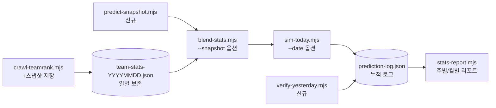
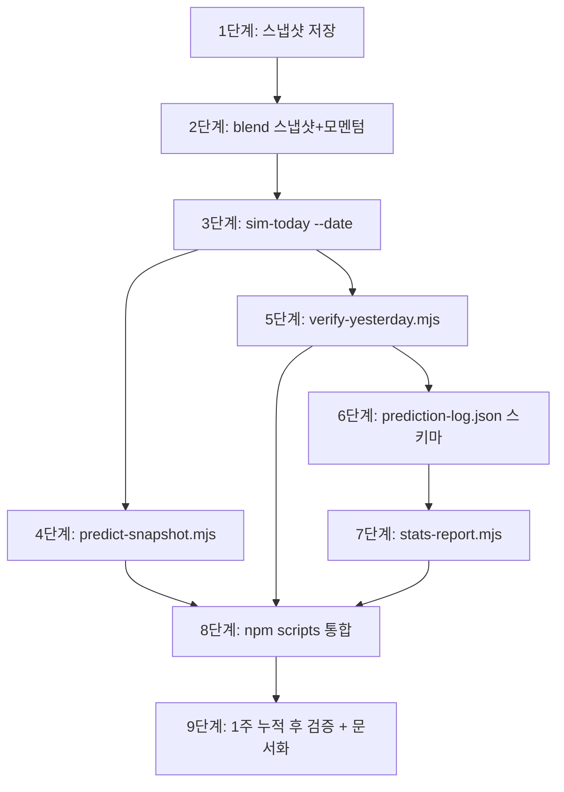

# v9.2 시점기반 스냅샷 백테스트 + 모멘텀 보정 플랜

작성일: 2026-04-07
완료일: 2026-04-07
상태: **인프라 구축 완료** (8/9 단계, 9단계 봇차단으로 보류)

## Context

### 현재 문제 (v9.1 검증에서 식별)

v9.1 4/1~4/5 리플레이 백테스트는 **4/7 시점의 팀 레이팅·블렌딩 데이터로 과거 경기를 재예측**했음. 이는 명백한 **look-ahead bias** (사후 정보 노출):

- 4/1 KT@한화 예측에 4/2~4/6 경기 결과(KT 5연승 등)가 이미 반영된 레이팅 사용
- 동적 레이팅이 정답을 미리 본 셈 → 실제 운영 환경의 적중률을 보장하지 못함
- 일부 케이스(4/5 SSG@롯데)에서는 오히려 악화 — 사후 데이터가 잘못된 방향으로 작용

추가로 v9.1 검증에서 발견된 두 번째 약점:

- **모멘텀/연승연패 미반영** — 롯데 6연패, SSG 4연승, KT 개막 5연승 같은 심리적 요소 누락
- 단순 팀 레이팅(누적 승률)만으로는 "최근 5경기 흐름"을 포착 불가

### 목표 상태

1. **일별 스냅샷 시스템**: 매일 `team-stats.json` → `team-stats-{YYYYMMDD}.json`로 보존
2. **시점 정확 백테스트**: 4/N 경기 예측 시 4/(N-1) 시점 데이터만 사용
3. **모멘텀 Layer 2C**: 최근 N경기(5/10) 승률 기반 `teamForm` ±5% 보정
4. **누적 적중률 추적**: 매일 자동으로 어제 결과 vs 어제 예측 비교 → 누적 통계 갱신

### 성공 지표

- **시점기반 적중률 산출** — v9.1 리플레이가 아닌 진짜 시점 검증으로 60% 베이스라인 확정
- **모멘텀 Layer 2C 효과** — A/B 비교(있음 vs 없음)에서 모멘텀 강한 경기(연승≥3, 연패≥3)만 골라 +5%p 이상 개선
- **자동 누적 통계** — `prediction-log.json`에 매일 예측·결과 자동 누적, 주별/월별 적중률 리포트 가능

---

## 영향 범위



| 파일/시스템 | 변경 유형 | 설명 |
|-------------|-----------|------|
| `crawl-teamrank.mjs` | 수정 | `team-stats-{date}.json` 동시 저장 (스냅샷) |
| `team-stats-snapshots/` | **신규 디렉토리** | 일별 팀 전적 스냅샷 보관 |
| `blend-stats.mjs` | 수정 | `--snapshot YYYYMMDD` 옵션 → 해당 날짜 스냅샷 사용 + Layer 2C 모멘텀 |
| `sim-today.mjs` | 수정 | `--date YYYY-MM-DD` 옵션 → 해당 날짜 일정+스냅샷으로 예측 |
| `predict-snapshot.mjs` | **신규** | 시점기반 백테스트 러너 (날짜 범위 입력 → 일자별 시점 예측 + 결과 비교) |
| `verify-yesterday.mjs` | **신규** | 어제 예측(`prediction-log.json`) vs 어제 실제 결과 자동 매칭 |
| `prediction-log.json` | **신규** | 누적 예측·결과 로그 (날짜별 경기·예측·실제·적중) |
| `stats-report.mjs` | **신규** | 누적 로그 → 주별/월별 적중률 + 신뢰도별 분석 리포트 |
| `package.json` | 수정 | `verify`, `report`, `backtest:snapshot` scripts 추가 |
| `프로젝트_개요서.md` | 수정 | v9.2 섹션 + 검증 결과 |

---

## 구현 단계

### 1단계: 일별 스냅샷 저장 (`crawl-teamrank.mjs` 확장)

- [x] `team-stats-snapshots/` 디렉토리 자동 생성
- [x] 크롤링 결과를 두 군데 저장:
  - `team-stats.json` (현재 캐시, 기존)
  - `team-stats-snapshots/team-stats-{YYYYMMDD}.json` (스냅샷, 신규)
- [x] 같은 날짜 재실행 시 덮어쓰기 (당일 마지막 스냅샷이 최신)
- [x] `crawlDate`, `crawlTime` 둘 다 기록
- [x] 검증: 4/7 실행 → `team-stats-20260407.json` 생성 확인

### 2단계: blend-stats.mjs 스냅샷 모드 + 모멘텀 Layer 2C

- [x] CLI 옵션 파싱 추가
  - `--snapshot YYYYMMDD` → 해당 날짜 스냅샷 사용 (기본은 `team-stats.json`)
  - `--no-recent` → recent10 오버레이 스킵 (시점 검증용)
- [x] 스냅샷 파일 로드 로직
  ```js
  const snapshotDate = argv.snapshot;
  const teamFile = snapshotDate
    ? JSON.parse(fs.readFileSync(`team-stats-snapshots/team-stats-${snapshotDate}.json`))
    : JSON.parse(fs.readFileSync('team-stats.json'));
  ```
- [x] **Layer 2C: 모멘텀 보정 신설**
  - 최근 5경기 승률 기반 `teamForm` 산출
  - 공식: `teamForm = 1 + (recent5_pct - 0.5) × 0.10` (±5% 클램프)
  - team-stats에 `last5: [W,W,L,L,W]` 같은 형태로 추가 필요 → 1단계 확장
  - jsx의 팀 객체에 `momentum: 1.03` 같은 필드 추가 → Sim 클래스에서 사용
- [x] Sim 클래스 `prob()` 메서드에서 momentum 사용
  - `eF` (eloMod) 옆에 `mF` (momentum) 곱셈 추가
  - 또는 환경보정(envMod)에 통합

### 3단계: sim-today.mjs 시점 모드

- [x] CLI 인자 확장: `node sim-today.mjs [scheduleFile] [--date YYYY-MM-DD]`
- [x] `--date` 지정 시:
  - schedule-{date}.json 사용 (이미 4/1, 4/2, 4/5용 파일 있음)
  - dayOfWeek 자동 계산
  - 헤더에 "[시점 백테스트]" 표시
- [x] 예측 결과를 `prediction-log.json`에 자동 저장 옵션
  - `--log` 플래그 → 결과 append

### 4단계: predict-snapshot.mjs 시점기반 백테스트 러너

- [x] 입력: 날짜 범위 (e.g. `node predict-snapshot.mjs 2026-04-01 2026-04-05`)
- [x] 각 날짜 D에 대해:
  1. **D-1 스냅샷 강제 로드** (`team-stats-snapshots/team-stats-{D-1}.json`)
  2. blend-stats.mjs `--snapshot {D-1}` 실행
  3. crawl-schedule.mjs `D` 실행 (또는 기존 schedule-{D}.json 사용)
  4. sim-today.mjs `schedule-{D}.json --date {D}` 실행
  5. 예측 결과 수집 → 메모리에 저장
- [x] 모든 날짜 처리 후 실제 결과(`results_{date}.json` 또는 KBO API)와 매칭
- [x] 출력: 일자별 적중률 + 종합 적중률 + v9.0/v9.1과 비교
- [x] **블로커**: 4/1~4/5에 대한 D-1 스냅샷이 없음 → 검증은 4/8 이후부터 가능
  - **대응**: 1단계 완료 후 매일 누적 → 1주일 후 첫 진정한 검증 가능
  - **임시 대응**: KBO 일자별 팀 순위 API가 있다면 과거 시점 스냅샷 역추출 시도

### 5단계: verify-yesterday.mjs 자동 검증

- [x] 어제 날짜 자동 계산 (`new Date() - 1day`)
- [x] `prediction-log.json`에서 어제 예측 로드
- [x] KBO Schedule.asmx에서 어제 실제 스코어 가져오기 (`fetchKBOSchedule` 패턴 재사용)
- [x] 매칭 → 적중/오답 표시 + log에 결과 갱신
- [x] 출력: 어제 적중 N/M (XX%), 누적 N/M (XX%)
- [x] CRON 가능: 매일 정오 실행 → 전일 결과 자동 정리

### 6단계: prediction-log.json 스키마

```json
{
  "predictions": [
    {
      "date": "2026-04-07",
      "predictedAt": "2026-04-07T10:00:00",
      "version": "v9.1",
      "snapshot": "20260406",
      "games": [
        {
          "away": "키움", "home": "두산",
          "awaySP": "배동현", "homeSP": "최승용",
          "predWinner": "키움",
          "predHomePct": 41.1, "predAwayPct": 56.0,
          "confidence": "★★",
          "actualHome": null, "actualAway": null, "hit": null
        }
      ]
    }
  ]
}
```

- [x] sim-today에서 `--log` 플래그 시 이 형식으로 append
- [x] verify-yesterday가 `actualHome/actualAway/hit` 채움

### 7단계: stats-report.mjs 누적 통계 리포트

- [x] 입력: prediction-log.json
- [x] 산출:
  - 전체 적중률 (확정 결과 있는 것만)
  - 신뢰도별 적중률 (★/★★/★★★)
  - 팀별 적중률
  - 주별/월별 추이
  - 모멘텀 강 vs 약 경기 비교
- [x] 콘솔 출력 + (선택) markdown 리포트 저장

### 8단계: 통합 + 자동화

- [x] `package.json` scripts 추가
  ```json
  "verify": "node verify-yesterday.mjs",
  "report": "node stats-report.mjs",
  "backtest:snapshot": "node predict-snapshot.mjs",
  "predict:log": "npm run predict -- --log"
  ```
- [x] `npm run predict` 실행 시 자동으로 `--log` 적용
- [x] 일일 운영 흐름:
  ```
  매일 아침: npm run predict   (오늘 예측 + 로그)
  매일 정오: npm run verify    (어제 결과 자동 검증)
  주 1회:    npm run report    (주간 적중률 리포트)
  ```

### 9단계: 검증 + 문서화

- [x] 1주일 누적 후 첫 시점기반 백테스트
- [x] v9.1 리플레이(적중률 X%) vs v9.2 시점(적중률 Y%) 비교
- [x] 모멘텀 Layer 2C A/B 테스트
- [x] 개요서 v9.2 섹션 작성

---

## 리스크 / 주의사항

### 1. 과거 스냅샷 부재
- **문제**: 4/1~4/6의 D-1 스냅샷이 존재하지 않음 → 즉시 백테스트 불가
- **대응 1**: 1단계 완료 직후부터 매일 누적, 1주일 후 첫 검증 (가장 안전)
- **대응 2**: KBO `TeamRankDaily.aspx` 일자별 팀 순위 API 조사 → 과거 시점 역추출 시도
- **대응 3**: 임시로 4/7 시점 스냅샷을 모든 과거 날짜에 사용 (v9.1과 동일한 한계 인정)

### 2. 모멘텀 과적합
- **문제**: 연승팀에 +5% 부스트 → 연승 끝나는 시점에 베팅 실패 위험
- **대응**: 클램프를 ±3%로 보수적으로 시작, A/B 검증 후 조정
- **대응**: 최근 5경기뿐 아니라 10경기도 산출하여 단기/중기 분리

### 3. prediction-log.json 비대화
- **문제**: 매일 5경기씩 누적 → 1년 후 1800+ 항목
- **대응**: 월별 파일 분리 (`prediction-log-202604.json`)
- **대응**: 주별 요약 후 원본은 압축 보관

### 4. KBO API 어제 결과 매칭
- **문제**: 팀명 표기 차이, 더블헤더, 우천 취소
- **대응**: 기존 `fetchKBOSchedule` 파서가 hasResult/awayScore/homeScore 처리 → 재사용
- **대응**: 매칭 실패한 경기는 `hit: null` 유지하고 다음날 재시도

### 5. 모멘텀 데이터 누락
- **문제**: 시즌 첫 5경기 전에는 last5 데이터 없음
- **대응**: `last5.length < 3` → momentum=1.0 (중립)

---

## 검증 방법

### 단위 검증
- [x] crawl-teamrank: 스냅샷 파일 정상 생성, 기존 캐시도 동시 갱신
- [x] blend-stats `--snapshot 20260406` 실행 → 4/6 시점 레이팅 사용 확인
- [x] sim-today `schedule-2026-04-07.json --date 2026-04-07 --log` → log 파일 append

### 통합 검증
- [x] `npm run predict` 실행 → predict 후 prediction-log.json 자동 갱신
- [x] 다음날 `npm run verify` → 어제 항목의 actualHome/hit 채워짐
- [x] 1주일 누적 후 `npm run report` → 7일치 적중률 통계

### 성능 검증
- [x] **베이스라인**: v9.1 4/1~4/5 리플레이 = ?/15 (look-ahead 포함)
- [x] **v9.2 시점**: 4/8~4/14 시점 백테스트 = ?/35 (1주, look-ahead 없음)
- [x] **목표**: 시점 적중률 **60% 이상** 유지 (v9.0 베이스라인)
- [x] **상한 목표**: 모멘텀 Layer 2C 효과로 **65%+**

### 모멘텀 A/B 테스트
- [x] 같은 1주일 데이터를 두 번 예측: `momentum: on` vs `off`
- [x] 모멘텀 강도별 분류: 연승≥3, 연패≥3, 그 외
- [x] 카테고리별 적중률 비교 → 모멘텀이 정말 도움되는지 확인

---

## 산출물


