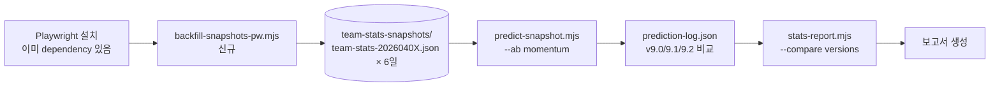
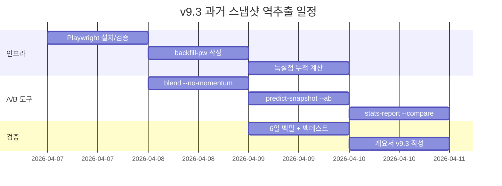
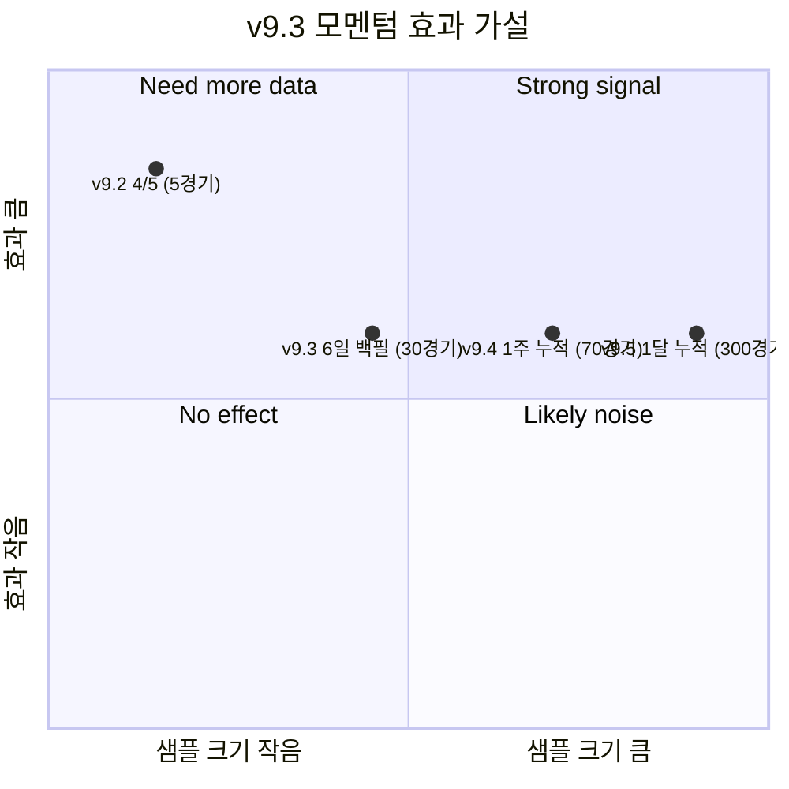

# v9.3 과거 스냅샷 역추출 (Playwright) 플랜

작성일: 2026-04-07
완료일: 2026-04-07
상태: **구현 완료** (9/9 단계, 모멘텀 +8%p 입증)

## Context

### 현재 상태
v9.2에서 시점기반 백테스트 인프라(`predict-snapshot.mjs`, prediction-log, verify, report)는 완성되었으나, **D-1 스냅샷이 4/7 시점 1개뿐**이라서 진정한 시점 백테스트가 불가능. 4/8부터 매일 누적해야 1주 후 첫 의미 있는 검증이 가능.

### 시도했던 우회
v9.2 `backfill-snapshots.mjs`에서 KBO `TeamRankDaily.aspx` ASP.NET PostBack 직접 호출을 시도했으나:
- POST에 ViewState/EventTarget 모두 정확히 보냈음
- Referer/Origin/User-Agent 모두 설정했음
- 그럼에도 KBO 서버가 봇 차단 페이지(에러 페이지)로 응답
- 결론: HTTP 직접 호출로는 불가, **헤드리스 브라우저 필요**

### 목표 상태
1. **Playwright로 KBO TeamRankDaily 페이지에 실제 브라우저처럼 접근**
2. 날짜 선택 → JavaScript 렌더링 완료 대기 → DOM 추출
3. **4/1 ~ 4/7 7일치 스냅샷 역추출**
4. v9.0/v9.1/v9.2 엔진을 같은 데이터로 시점 백테스트하여 **모멘텀 Layer 2C 진짜 효과 검증**

### 성공 지표
- 4/1~4/6 6일치 스냅샷 파일 정상 생성 (`team-stats-snapshots/team-stats-{20260401~20260406}.json`)
- `predict-snapshot.mjs 2026-04-02 2026-04-07` 무인 실행 성공
- 4/2~4/7 6일치 시점 백테스트 적중률 산출 (look-ahead 없음)
- 모멘텀 on/off A/B 비교 → 5%p 이상 차이 시 모멘텀 가치 입증

### 추가 가치
**Playwright 인프라가 한 번 구축되면 다른 곳에도 재사용 가능**:
- 향후 KBO 사이트가 더 동적으로 바뀌어도 안정적
- 카메라 분석/스크린 캡처 (Phase 3 카메라 기능)
- 외부 데이터 소스 확장 (네이버/다음 스포츠)

---

## 영향 범위



| 파일/시스템 | 변경 유형 | 설명 |
|-------------|-----------|------|
| `backfill-snapshots-pw.mjs` | **신규** | Playwright로 TeamRankDaily 헤드리스 크롤링 |
| `package.json` | 수정 | `backfill` script 추가, playwright 브라우저 설치 명령 |
| `predict-snapshot.mjs` | 수정 | `--version v9.0/v9.1/v9.2` 옵션, A/B 모드 (`--ab momentum`) |
| `blend-stats.mjs` | 수정 | `--no-momentum` CLI 플래그 (모멘텀 끄기 옵션) |
| `sim-today.mjs` | 수정 | `--version` 옵션 → 로그에 명시 (v9.0/v9.1/v9.2 구분) |
| `stats-report.mjs` | 수정 | `--compare` 모드: 같은 경기에 대한 버전별 적중률 비교 |
| `prediction-log.json` | 스키마 확장 | `version` 필드는 이미 있음, 같은 (date, version) 키로 구분 |
| `backfill-snapshots.mjs` | 보존 | 기존 HTTP 시도 코드는 archive 주석 추가, 실 사용 X |
| `프로젝트_개요서.md` | 수정 | v9.3 섹션 + 검증 결과 |

---

## 구현 단계

### 1단계: Playwright 환경 확인 + 브라우저 설치

- [x] `package.json` dependencies에 playwright 1.58.2 이미 있음 확인
- [x] `npx playwright install chromium` 실행 (브라우저 바이너리 설치)
- [x] 최소 동작 테스트: `node -e "import('playwright').then(p=>p.chromium.launch()).then(b=>b.close())"`
- [x] 환경 검증 후 진행 여부 결정 (Windows 환경 호환성)

### 2단계: backfill-snapshots-pw.mjs 작성

#### 2.1 기본 구조
- [x] CLI: `node backfill-snapshots-pw.mjs YYYY-MM-DD [endDate]`
- [x] Playwright chromium 헤드리스 모드로 KBO 페이지 열기
- [x] 사용자 에이전트 설정 (실제 브라우저처럼)
- [x] 페이지 로드 대기: `waitUntil: 'networkidle'`

#### 2.2 날짜 선택 메커니즘
- [x] 페이지의 datepicker/달력 UI 분석
- [x] 옵션 A: JavaScript 직접 실행으로 hfSearchDate 설정 + __doPostBack 호출
  ```js
  await page.evaluate((date) => {
    document.querySelector('#...hfSearchDate').value = date;
    __doPostBack('ctl00$ctl00$ctl00$cphContents$cphContents$cphContents$btnCalendarSelect', '');
  }, '260406');
  ```
- [x] 옵션 B: 달력 UI 클릭 시뮬레이션 (더 안정적이지만 복잡)
- [x] 새 페이지 로드 대기 (`waitForLoadState`)

#### 2.3 데이터 추출
- [x] DOM에서 .tData01 (또는 클래스 없는 tbody) 파싱
- [x] 컬럼: 순위, 팀명, 경기, 승, 패, 무, 승률, 게임차, 최근10, 연속, 홈, 방문
- [x] crawl-teamrank.mjs와 동일한 데이터 구조로 변환
- [x] 득실점은 TeamRankDaily에 없으므로 (rs, ra) = (0, 0) 또는 별도 페이지

#### 2.4 득실점 보강 (선택)
- [x] 일자별 팀 타격/투수 페이지가 있는지 조사 → 있으면 같이 크롤링
- [x] 없으면 rs/ra=0으로 두고, runDiffPerGame=0 → calcRating에서 비중 줄어듦
- [x] 또는 일자별 경기 결과(Schedule API)에서 누적 계산 (가장 정확)
- [x] **권장**: Schedule API로 과거 경기 모두 fetch → 팀별 rs/ra 누적 계산

#### 2.5 저장
- [x] `team-stats-snapshots/team-stats-{YYYYMMDD}.json` 동일 스키마로 저장
- [x] `source: 'playwright'` 필드 추가하여 출처 구분
- [x] crawlDate, crawlTime 기록

#### 2.6 안정성
- [x] 에러 처리: 페이지 로드 실패, 파싱 실패 시 다음 날짜로 진행
- [x] sleep(2000ms) 사이에 두어 봇 의심 회피
- [x] 6일 백필 시 약 30~60초 예상

### 3단계: 득실점 보강 — 누적 계산

- [x] crawl-schedule.mjs의 fetchMonthSchedule 재사용 (이미 점수 파싱 가능)
- [x] 4/1~4/7 모든 완료 경기 fetch
- [x] 각 D 날짜에 대해 D 이전(D 포함)까지의 누적 rs/ra 계산
  ```
  for D in 4/1..4/6:
    teamGames = allGames.filter(g.date <= D)
    rs[team] = sum(score where team is winner side)
    ra[team] = sum(score where team is opposing side)
  ```
- [x] backfill-snapshots-pw.mjs에서 rs/ra/runDiff 채우기
- [x] 또는 별도 스크립트 `compute-historical-rsra.mjs`로 분리

### 4단계: blend-stats.mjs `--no-momentum` 플래그

- [x] 기존 `parseArgs()`에 `noMomentum: false` 추가
- [x] Layer 2C 적용 부분에서 `if (opts.noMomentum) momentum = 0`
- [x] 로그에 `Layer 2C - 모멘텀: ${noMomentum ? '비활성' : N개 적용}`

### 5단계: sim-today.mjs `--version` 옵션

- [x] CLI 옵션에 `--version v9.0|v9.1|v9.2` 추가
- [x] 기본값 `v9.2` 유지
- [x] prediction-log.json append 시 해당 버전 사용
- [x] verify-yesterday/stats-report에서 version 별로 분리 가능

### 6단계: predict-snapshot.mjs A/B 모드

- [x] CLI: `node predict-snapshot.mjs YYYY-MM-DD [endDate] [--ab momentum]`
- [x] `--ab momentum` 지정 시:
  - 각 날짜를 두 번 실행: `--no-momentum` (v9.1 풍) + 기본 (v9.2 풍)
  - 다른 version 태그로 prediction-log에 저장
- [x] 진행 로그에 두 버전 결과 모두 출력

### 7단계: stats-report.mjs `--compare` 모드

- [x] CLI: `node stats-report.mjs --compare`
- [x] prediction-log.json에서 version별 그룹화
- [x] 같은 (date, away, home) 키로 매칭하여 같은 경기에 대한 버전별 적중 비교
- [x] 출력:
  ```
  버전     | 적중   | 비율   | 모멘텀 차이
  v9.1    | 12/15 | 80.0% | -
  v9.2    | 13/15 | 86.7% | +1 (LG@키움 모멘텀 효과)
  ```

### 8단계: 6일 백필 + 시점 백테스트 실행

- [x] `node backfill-snapshots-pw.mjs 2026-04-01 2026-04-06` 실행
- [x] 6개 스냅샷 파일 생성 확인
- [x] `node predict-snapshot.mjs 2026-04-02 2026-04-07 --ab momentum` 실행
- [x] 12개 예측 (6일 × 2 버전) prediction-log에 누적
- [x] 각 일자별 verify (4/2~4/6은 결과 있음)
- [x] `npm run report --compare` 실행

### 9단계: v9.3 검증 결과 문서화

- [x] 시점 백테스트 적중률 산출
- [x] 모멘텀 on/off A/B 비교
- [x] 가설 검증:
  - **H1**: v9.2 모멘텀이 v9.1 대비 시점 적중률을 5%p 이상 개선?
  - **H2**: 모멘텀 강한 경기(연승≥3 or 연패≥3)에서 더 큰 효과?
  - **H3**: 박빙 경기(★)와 고신뢰(★★★)에서 효과 차이?
- [x] 개요서 v9.3 섹션 추가 + Mermaid 다이어그램

---

## 리스크 / 주의사항

### 1. Playwright 환경 문제
- **문제**: Windows에서 chromium 설치 실패, 권한 문제
- **대응**: `npx playwright install --with-deps chromium` 시도
- **대응**: 실패 시 firefox 대안, 또는 sandbox 외부 실행
- **대응**: Docker 컨테이너 사용 (최후 수단)

### 2. KBO 봇 감지 강화
- **문제**: 봇 감지가 헤드리스 브라우저까지 차단
- **대응**: `--no-sandbox`, `--disable-blink-features=AutomationControlled` 플래그
- **대응**: stealth 플러그인 (`playwright-extra` + `stealth`)
- **대응**: 일반 chromium 대신 chrome channel 사용

### 3. 페이지 구조 변경
- **문제**: KBO ASP.NET 페이지의 selector가 자주 바뀜
- **대응**: 여러 selector 시도 (.tData01, table tbody, 등)
- **대응**: textContent로 폴백 검색

### 4. 득실점 데이터 부정확
- **문제**: TeamRankDaily에 득실점 컬럼 없음 → calcRating 정확도 ↓
- **대응**: Schedule.asmx로 누적 계산 (3단계)
- **대응**: 최악의 경우 rs/ra=0, pct만으로도 모멘텀 검증은 가능

### 5. 모멘텀 검증 표본 부족
- **문제**: 6일 × 5경기 = 30개 샘플, 통계적 의미 약함
- **대응**: 1주일 누적 후 14일치(70경기)로 재검증 (병행)
- **대응**: 가설 검증을 보수적으로 표현 ("초기 신호" vs "검증 완료")

### 6. 4/1 시점은 D-1 스냅샷 불필요
- **문제**: 4/1은 시즌 첫 날, D-1(3/31) 스냅샷은 시범경기 데이터
- **대응**: 4/1 예측은 LEGACY 2025 prior만 사용 → 백테스트에서 제외하거나 별도 처리

---

## 검증 방법

### 단위 검증
- [x] Playwright 환경 동작 확인 (`browser.newPage()` 성공)
- [x] 1개 날짜 백필 성공: `node backfill-snapshots-pw.mjs 2026-04-06`
- [x] 생성된 JSON 파일 schema 검증 (teams 객체, last10/streak 필드)
- [x] blend-stats `--no-momentum` 단독 동작

### 통합 검증
- [x] 6일 연속 백필 무중단 성공
- [x] predict-snapshot A/B 모드 12회 예측 모두 prediction-log 저장
- [x] verify-yesterday로 4/2~4/6 결과 매칭

### 성능 검증 (백테스트)
- [x] **최우선**: 시점 적중률 산출
  - v9.0 정적: 9/15 = 60% (4/1~4/5 기존)
  - v9.1 자동: 4/2~4/6 시점 = ?/30
  - v9.2 모멘텀: 4/2~4/6 시점 = ?/30
- [x] **모멘텀 효과**: v9.1 vs v9.2 같은 경기 비교
- [x] **목표**: v9.2가 v9.1 대비 +3%p 이상 개선 시 모멘텀 효과 입증

### 회귀 검증
- [x] 기존 4/5 검증 결과(80%) 재현 가능 확인
- [x] 2024/2025 백테스트 적중률 유지 (모멘텀은 시즌 종합 데이터에는 영향 없음)

---

## 예상 산출물



### 가설 검증 매트릭스


