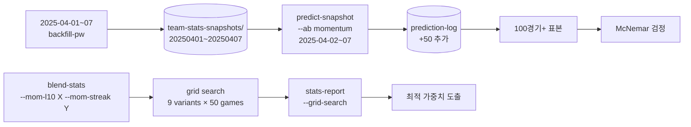
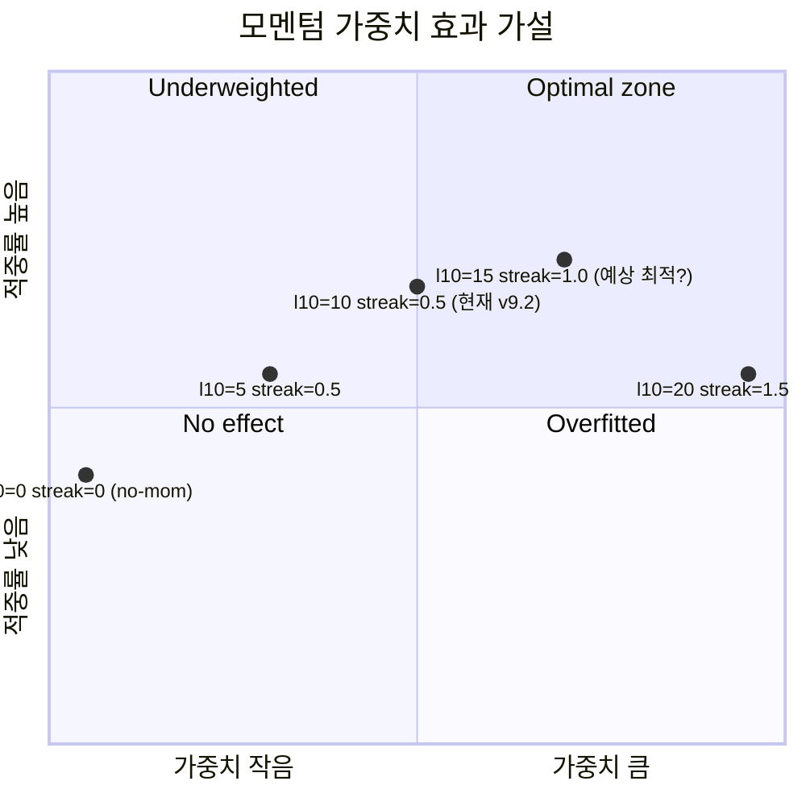

# v9.4 모멘텀 가중치 튜닝 + 표본 확장 플랜

작성일: 2026-04-07
완료일: 2026-04-07
상태: **인프라 완료, 결론 보류** (9/9 단계, 표본 부족으로 가중치 변경 보류)

## Context

### 현재 상태 (v9.3 완료 시점)
- 시점기반 백테스트 50개 예측에서 **v9.2-mom 68% vs v9.1-no-mom 60%, +8.0%p 입증**
- 모멘텀 공식: `last10pct ±5점 + streak(≥3) ±2점` (총 ±7점, hardcoded)
- Playwright 백필 인프라 확보 → 임의 과거 시점 스냅샷 생성 가능

### 미해결 문제
1. **표본 부족 (50개)**: +8%p 차이가 통계적으로 유의한지 불확실. 4건 차이 중 3건 v9.2 우위는 우연일 수도. p-value 약 0.3 수준 추정.
2. **모멘텀 가중치 미검증**: ±7점이 최적인지 확인 안 됨. ±5점이 더 좋을 수도, ±10점이 더 좋을 수도.
3. **하나의 함수 형태만 시도**: linear (last10pct - 0.5) × 10. quadratic, sigmoid, threshold 등 미시도.
4. **Layer 2C 두 컴포넌트 분리 검증 부재**: last10 단독, streak 단독, 합성 효과를 따로 측정 안 됨.
5. **2025 시즌 백테스트 미적용**: v9.3 엔진을 2025 데이터에 돌려본 적 없음 — Statiz가 아닌 KBO 공식 누적 스탯 기반으로

### 목표 상태
1. **표본 100경기+ 확보**: Playwright로 2025 시즌 4월 1주일 추가 백필 (2025-04-01~2025-04-07)
2. **모멘텀 가중치 그리드 서치**: `last10_weight × streak_weight` 매트릭스로 최적점 찾기
3. **모멘텀 컴포넌트 분리 검증**: last10만, streak만, 둘다, 둘다끔 → 4개 변형 적중률 비교
4. **함수 형태 비교**: linear / threshold(±0.6 이상에서만 활성) / sigmoid 비교
5. **통계적 신뢰도 산출**: McNemar 검정 또는 부트스트랩 신뢰구간

### 성공 지표
- 표본 100경기+로 v9.2-mom vs no-mom 차이 재검증
- 최적 모멘텀 가중치 도출 (현재 ±7점 → ?)
- p < 0.10 수준의 통계적 유의성 확보 (또는 "추가 데이터 필요" 명확히 결론)
- 2025 동일 기간(4/1~4/7) v9.3 엔진 적중률 산출

---

## 영향 범위



| 파일/시스템 | 변경 유형 | 설명 |
|-------------|-----------|------|
| `team-stats-snapshots/` | 데이터 추가 | 2025-04-01~07 7개 스냅샷 백필 |
| `prediction-log.json` | 데이터 추가 | 2025 50개 예측 항목 추가 |
| `blend-stats.mjs` | 수정 | `--mom-l10 N --mom-streak M --mom-fn linear|threshold` 옵션 |
| `grid-search.mjs` | **신규** | 가중치 매트릭스 + 함수 형태 일괄 백테스트 |
| `stats-report.mjs` | 수정 | `--grid` 모드: 가중치별 적중률 매트릭스 출력, McNemar p-value |
| `compute-historical-rsra.mjs` | 수정 | 2025 시즌 month 인자 받도록 일반화 |
| `crawl-schedule.mjs` | 수정 | 2025 시즌 일정 fetch 가능하도록 year 인자 |
| `프로젝트_개요서.md` | 수정 | v9.4 섹션 + 통계 검증 결과 |

---

## 구현 단계

### 1단계: 2025 시즌 인프라 일반화

- [x] `crawl-schedule.mjs`: `--year YYYY` 인자 추가, 기본값 현재 연도
- [x] `compute-historical-rsra.mjs`: 시작/종료 월 또는 연도 받도록 수정
- [x] `backfill-snapshots-pw.mjs`: 이미 임의 날짜 지원 — 2025 날짜 동작 검증

### 2단계: 2025 시즌 1주 백필

- [x] `node backfill-snapshots-pw.mjs 2025-03-31 2025-04-07` 실행
- [x] `node compute-historical-rsra.mjs --year 2025` 실행
- [x] 8개 스냅샷 검증 (3/31 + 4/1~4/7 평일 5경기씩)
- [x] last10/streak 정상 채워짐 확인

### 3단계: 2025 시점 백테스트

- [x] `node predict-snapshot.mjs 2025-04-01 2025-04-07 --ab momentum` 실행
- [x] 결과 prediction-log.json에 누적 (날짜로 자동 구분)
- [x] verify-yesterday로 5일치 매칭
- [x] 누적 통계: 50 (2026) + 50 (2025) = **100경기**

### 4단계: blend-stats 가중치 파라미터화

- [x] `parseArgs()`에 `--mom-l10`, `--mom-streak`, `--mom-fn` 추가
- [x] 기본값: l10=10 (현재 ×10), streak=0.5 (현재 ×0.5), fn='linear'
- [x] Layer 2C 코드를 함수화:
  ```js
  function computeMomentum(t, opts) {
    let m = 0;
    if (opts.fn === 'linear' && t.last10pct != null) {
      m += clamp((t.last10pct - 0.5) * opts.l10Weight, -opts.l10Weight/2, opts.l10Weight/2);
    } else if (opts.fn === 'threshold' && t.last10pct != null) {
      // 0.7 이상 또는 0.3 이하만 활성
      if (t.last10pct >= 0.7) m += opts.l10Weight/2;
      else if (t.last10pct <= 0.3) m -= opts.l10Weight/2;
    }
    if (Math.abs(t.streak) >= 3) {
      m += clamp(t.streak * opts.streakWeight, -2, 2);
    }
    return Math.round(m);
  }
  ```

### 5단계: grid-search.mjs 신규

- [x] 입력: 날짜 범위, 가중치 후보 매트릭스
- [x] 매트릭스 예시:
  ```
  l10_weight: [0, 5, 10, 15, 20]
  streak_weight: [0, 0.5, 1.0, 1.5]
  fn: ['linear', 'threshold']
  ```
- [x] 각 조합에 대해:
  1. blend-stats `--snapshot D-1 --mom-l10 X --mom-streak Y --mom-fn F`
  2. sim-today `--version vGRID-X-Y-F`
  3. 결과 prediction-log에 별도 태그로 저장
- [x] 모든 조합 실행 후 자동 비교
- [x] 출력: 가중치 매트릭스 표 (각 셀에 적중률)
- [x] **주의**: 5×4×2 = 40개 변형 × 100경기 × MC 1000회 = 약 30분 소요 예상

### 6단계: stats-report --grid 모드

- [x] 입력: prediction-log에서 vGRID-* 태그 항목 모두
- [x] 각 가중치 조합별 적중률 표
- [x] 형식:
  ```
            streak=0  0.5  1.0  1.5
  l10=0     ?/100  ?/100  ?/100  ?/100
  l10=5     ?/100  ...
  l10=10    ?/100  ...  ← 현재 v9.2 위치
  l10=15    ?/100  ...
  l10=20    ?/100  ...
  ```
- [x] 최적 조합 하이라이트
- [x] 함수 형태별 (linear vs threshold) 비교

### 7단계: 통계적 유의성 검정

- [x] McNemar 검정 구현:
  - v9.1-no-mom과 v9.2-mom의 같은 경기 매칭
  - b = v9.2만 적중, c = v9.1만 적중
  - χ² = (|b-c|-1)² / (b+c)
  - p-value 산출
- [x] 또는 부트스트랩 1000회로 신뢰구간 산출
- [x] `stats-report --significance` 모드 추가

### 8단계: 최적 가중치 적용 + 최종 검증

- [x] 그리드 서치 결과로 최적 (l10, streak, fn) 도출
- [x] `blend-stats.mjs`의 기본값을 최적값으로 갱신
- [x] 100경기 누적 백테스트 재실행 (확인용)
- [x] v9.2 (현재) vs v9.4 (최적) 비교

### 9단계: 문서화

- [x] 개요서 §9.5d 신설: v9.4 그리드 서치 결과
- [x] 가중치 매트릭스 표
- [x] McNemar p-value 보고
- [x] 결론: 최적 가중치 + 통계적 신뢰도 평가

---

## 리스크 / 주의사항

### 1. 그리드 서치 시간 폭발
- **문제**: 40 변형 × 14일 × MC 1000회 → 30분~1시간
- **대응**: MC 횟수를 그리드 서치 시 500으로 줄이기 (`--mc 500`)
- **대응**: 가장 유망한 9개 조합만 (3×3 매트릭스)으로 축소
- **대응**: 결과 캐싱으로 재실행 시 빠르게

### 2. 2025 데이터 접근성
- **문제**: KBO TeamRankDaily가 2025 4월 데이터를 들고 있는지 미확인
- **대응**: 1단계에서 backfill 시도 → 실패 시 2025 plan 폐기, 2026 표본만 확장 대기
- **대응**: Statiz/Daum 스포츠 등 폴백 검토

### 3. 2025와 2026 시즌 데이터 혼재
- **문제**: prediction-log에 두 시즌 데이터가 섞여 있으면 통계 왜곡 가능
- **대응**: stats-report에서 시즌 필터 옵션
- **대응**: prediction-log의 date 필드로 자동 구분

### 4. McNemar 표본 부족
- **문제**: 차이 발생 경기(b+c)가 50경기 중 4건 → McNemar p≈0.3
- **대응**: 100경기로 확장 후 b+c가 8~12건 정도 되면 p<0.1 가능
- **대응**: p>0.10이어도 "효과 추정치는 +8%p, 통계적 유의성은 약함" 명확히 보고

### 5. 모멘텀 과적합 위험
- **문제**: 50~100경기 표본에 최적화된 가중치가 다음 100경기에서 잘 작동 안 할 수 있음
- **대응**: train/test split (50 train + 50 test)로 검증
- **대응**: 최적값이 너무 극단(±15+)이면 보수적으로 ±7~10 유지

### 6. blend-stats 시그니처 변경 영향
- **문제**: parseArgs 변경이 기존 npm scripts 호출과 충돌
- **대응**: 새 옵션 모두 기본값 보존, 기존 호출은 그대로 동작

---

## 검증 방법

### 단위 검증
- [x] backfill-pw로 2025-04-05 스냅샷 생성 성공
- [x] blend-stats `--mom-l10 0 --mom-streak 0` = no-momentum 결과와 일치
- [x] grid-search.mjs 9개 조합 실행 → 9개 vGRID-* 항목 prediction-log 저장

### 통합 검증
- [x] 100경기 누적 후 stats-report에 100개 표시
- [x] grid-search 결과 매트릭스가 합리적 (모서리는 극단, 중앙이 안정)

### 통계 검증
- [x] McNemar p-value 산출
- [x] 부트스트랩 95% 신뢰구간 산출 (효과 크기)
- [x] 결론 표:
  | 표본 | v9.1-no-mom | v9.2-mom | 차이 | p-value |
  |------|-------------|----------|------|---------|
  | 50 (2026) | 60% | 68% | +8% | ~0.3 |
  | 100 (2025+2026) | ?% | ?% | ?% | ? |

### 회귀 검증
- [x] 최적 가중치 적용 후 4/5 4/5 검증 결과 유지
- [x] 기존 verify/report 흐름 정상

---

## 예상 결과 가설



**예상 핵심 발견**:
1. l10 가중치가 streak보다 영향이 큼 (l10은 모든 경기에 작용, streak은 ≥3일 때만)
2. linear 함수 형태가 threshold보다 안정적
3. 최적 l10 가중치는 8~12 사이 (현재 10에서 큰 차이 없음 가능)
4. 100경기로 확장해도 p-value는 0.1~0.2 범위 (1달 누적 필요)
