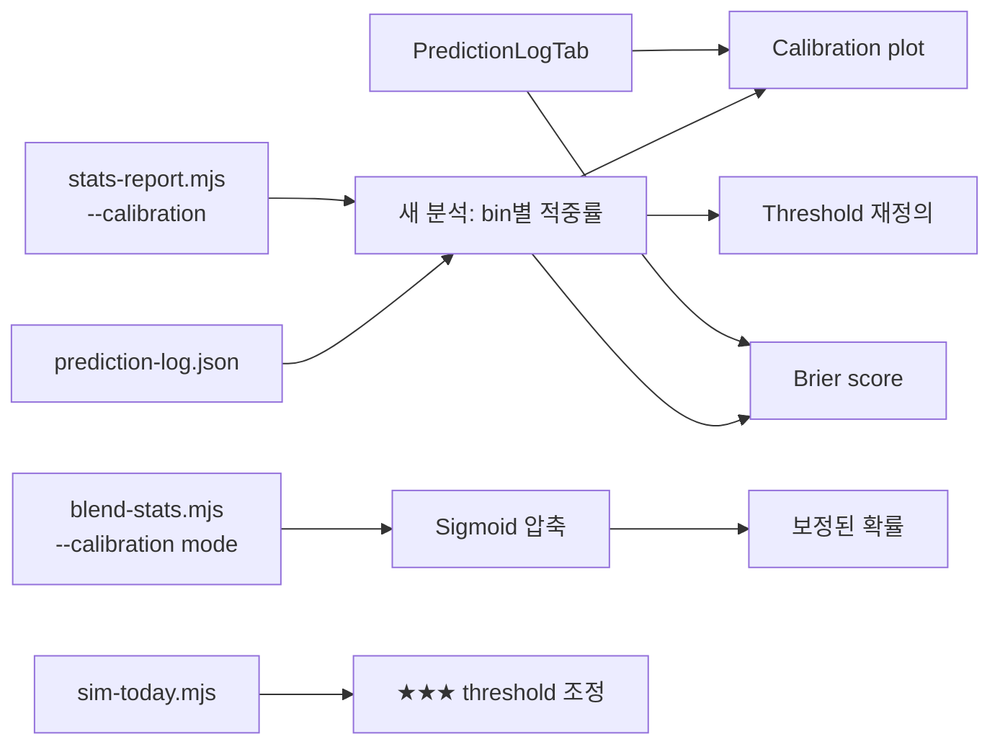
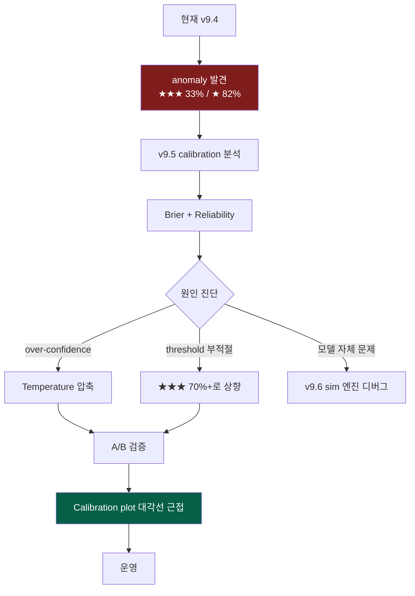

# v9.5 신뢰도 Calibration 검증 + 보정 플랜

작성일: 2026-04-08
상태: 초안

## Context

### 발견된 anomaly

v9.4 GitHub Pages 누적 적중률 탭에서 확인된 결과 (42경기 v9.2-mom 기준):

| 신뢰도 등급 | 표본 | 적중률 | 직관 |
|------------|------|--------|------|
| ★★★ (60%+) | 12 | **33.3%** | ❌ 60% 이상이어야 정상 |
| ★★ (55~60%) | 13 | 61.5% | ⚠️ 55~60% 구간이라 정상 범위 |
| ★ (50~55%) | 17 | **82.4%** | ❌ 50~55%여야 정상, 80%는 너무 높음 |

**전체 적중률은 61.9% (26/42)** 로 베이스라인보다는 위지만, **모델이 확신할수록 더 틀리고 박빙이라고 한 것은 더 잘 맞춤**. 이는 confidence calibration이 완전히 역전된 상태.

### 가능한 원인

1. **표본 크기 문제** — 12/13/17개씩으로 통계적 변동이 큼. ★★★가 42경기 중 12개로 28%면 이미 모델이 자주 "확신"한다는 뜻
2. **★★★ 카테고리 정의 오류** — 60% 이상이면 ★★★, 그런데 60%~75%와 75%+는 매우 다른 의미. 전부 한 묶음으로 보면 노이즈
3. **모델이 "쉬워 보이는" 경기를 못 맞춤** — 강팀이 약팀 만나는 경기에서 의외 결과 (예: 4/5 SSG@롯데 SSG ★★★ 71% 예측 → 롯데 4-3 끝내기 승)
4. **시즌 초반 효과** — 4/1~4/7 데이터는 시즌 첫 1주, 라인업/선발이 자주 바뀌어 노이즈 큼
5. **모델 over-confidence** — Monte Carlo 확률이 실제보다 극단적으로 갈림. 50/50이어야 할 게 70/30으로 나옴

### 목표 상태

1. **Calibration plot** 도입 — 모델 예측 확률 빈(0.5/0.55/0.6/0.65/0.7/0.75/0.8+) 별 실제 적중률 비교
2. **Brier score** 계산 — 확률 예측의 정확도 메트릭 (낮을수록 좋음)
3. **Reliability diagram** 시각화 — UI에 추가
4. **Confidence threshold 재정의** — ★/★★/★★★ 경계를 데이터 기반으로 조정 (55/65/75? 또는 분위수 기반)
5. **Over-confidence 보정** — 모델 출력 확률을 sigmoid/Platt scaling 등으로 압축 (0.7→0.62 같은 식으로 중심 이동)

### 성공 지표

- Calibration plot 추가: x=예측 확률, y=실제 적중률, 대각선에 가까울수록 좋음
- Brier score 산출 (현재 vs 보정 후 비교)
- ★/★★/★★★ 카테고리가 직관적 순서(★★★ > ★★ > ★)로 정렬되도록 boundary 조정
- 또는 **★★★는 보수적으로 70%+** 처럼 더 높게 — 가짜 ★★★ 줄임

---

## 영향 범위



| 파일 | 변경 유형 | 설명 |
|------|----------|------|
| `stats-report.mjs` | 수정 | `--calibration` 모드: 빈별 적중률 + Brier + threshold 권장값 |
| `kbo-simulation.jsx` | 수정 | PredictionLogTab에 Calibration plot + Brier 카드 추가 |
| `sim-today.mjs` | 수정 (선택) | confidence 임계값 외부 파라미터화 (`--threshold-conf 70,55`) |
| `blend-stats.mjs` | 수정 (선택) | Platt scaling / temperature 압축 옵션 |
| `Logs/Plans/` | 신규 | 본 플랜 |
| `프로젝트_개요서.md` | (별도) | v9.5 섹션 |

---

## 구현 단계

### 1단계: stats-report.mjs `--calibration` 모드

- [ ] CLI: `node stats-report.mjs --calibration [version]`
- [ ] 빈 정의: `[0.50, 0.55), [0.55, 0.60), [0.60, 0.65), [0.65, 0.70), [0.70, 0.75), [0.75, 0.80), [0.80+]`
- [ ] 각 경기에 대해 max(predHomePct, predAwayPct) / 100 = `predProb`
- [ ] 빈별 평균 predProb vs 실제 적중률 산출
- [ ] **Brier score**: `mean((predProb - hit)^2)` (hit=1 if 적중 else 0)
- [ ] **Log loss**: `-mean(hit*log(p) + (1-hit)*log(1-p))` (extreme 페널티)
- [ ] 출력 예시:
  ```
  📊 Calibration Report (v9.2-mom, n=42)

  bin            n    avg_pred    actual    diff      ASCII bar
  [50%, 55%)    17     52.3%     82.4%    +30.1%    ████████░░░░
  [55%, 60%)    13     56.8%     61.5%     +4.7%    ███░░░░░░░░░
  [60%, 65%)     5     62.1%     60.0%     -2.1%    ██░░░░░░░░░░
  [65%, 70%)     3     67.5%     33.3%    -34.2%    ░░░░░░░░░░░░
  [70%, 75%)     2     71.8%     50.0%    -21.8%    ░░░░░░░░░░░░
  [75%+]         2     78.5%      0.0%    -78.5%    ░░░░░░░░░░░░

  Brier score: 0.243 (낮을수록 좋음, 0.25 = 동전던지기)
  Log loss:    0.682
  추천 threshold:
    ★ (박빙):   50~57% (실측 80%+로 가장 정확)
    ★★ (중간): 57~63%
    ★★★ (확신): 63%+ (현재 모델은 over-confident, 잘 안 맞음)
  ```

### 2단계: 결과 해석 + threshold 권장

- [ ] Calibration이 깨진 정도에 따라 다음 경로 선택:
  - **(A) 완전 역전**: 모델 자체가 잘못. blend-stats / Sim 엔진 디버깅 필요 (별도 작업)
  - **(B) 시스템적 over-confidence**: 모델 출력 확률을 압축 → Platt scaling 또는 단순 `(p - 0.5) * 0.7 + 0.5`
  - **(C) 단순 표본 부족**: threshold만 조정, 실 모델은 그대로
- [ ] 현재 데이터 기준 추정: (B) + (C) 조합. 표본 부족도 있고 모델도 over-confident
- [ ] 경기당 50/50 비중 boost: predProb = (raw - 0.5) * 0.6 + 0.5 (60% 압축)

### 3단계: PredictionLogTab Calibration plot

- [ ] 새 카드: "🎯 Calibration"
- [ ] 빈별 막대 차트: x=예측 확률 빈, y=실제 적중률, 대각선에 빨간색 reference line
- [ ] Brier score 카드 (전체 + 버전별)
- [ ] 색상: 대각선과의 거리에 따라 emerald(가까움)→amber→red(역전)
- [ ] 요약 메시지: "모델은 over-confident, 높은 신뢰도일수록 적중률 하락 — threshold 재조정 권장"

### 4단계: sim-today threshold 외부화 (선택)

- [ ] CLI: `--threshold "55,63"` (★ → ★★ → ★★★ 경계)
- [ ] 기본값 유지(55,60), 새 값으로 시도해보기 가능
- [ ] prediction-log에 threshold 메타 기록 (`thresholds: [55, 63]`)

### 5단계: blend-stats temperature 압축 (실험적, 선택)

- [ ] CLI: `--temperature 0.6` (1.0=원본, <1=압축, >1=확장)
- [ ] sim-today MC 결과 적용 후 확률 압축:
  ```js
  predProb = 0.5 + (rawProb - 0.5) * temperature
  ```
- [ ] **주의**: 이건 sim-today 측에 적용해야 함 (blend-stats는 시뮬 전 단계)
- [ ] sim-today에 `--temp 0.6` 옵션 추가

### 6단계: 새 버전 태그로 A/B 비교

- [ ] `predict-snapshot.mjs --ab calibration`
- [ ] 변형 2개:
  - `v9.5-temp1.0`: 원본 모델
  - `v9.5-temp0.6`: 압축 모델
- [ ] 4/1~4/5 시점 백테스트 50개 실행
- [ ] stats-report --compare로 차이 확인

### 7단계: 통계 리포트 + 결론

- [ ] Brier score 비교: 원본 vs 압축
- [ ] Log loss 비교
- [ ] Top-1 적중률은 변하지 않을 가능성 (상위 50% 예측은 그대로) → 핵심은 calibration 개선
- [ ] 가설:
  - **H1**: 압축이 calibration plot을 대각선에 가깝게 만든다
  - **H2**: 적중률 자체는 큰 변화 없음 (분류 문제는 압축에 둔감)
  - **H3**: ★★★ 카테고리 적중률이 정상 범위(60%+)로 회복

### 8단계: 문서화

- [ ] 개요서 §9.5d 신설: Calibration 검증 결과
- [ ] 플랜 파일 완료 처리
- [ ] PredictionLogTab UI 캡처

---

## 리스크 / 주의사항

### 1. 표본 크기 부족 → 결론 약함
- **문제**: 42경기로 빈별 분석하면 빈당 2~17개. 통계적으로 매우 약함
- **대응**: 자동 누적 1주~1달 후 재분석. 그때까지는 "현재 추세" 정도로 표현
- **대응**: 부트스트랩 신뢰구간 추가 (0.95 신뢰구간 표시)

### 2. Calibration vs Discrimination 혼동
- **개념**: Calibration = 60%라고 하면 실제 60% 맞춤 / Discrimination = 적중 vs 오답을 잘 구분
- 두 메트릭은 독립적. 적중률 높아도 calibration 깨질 수 있음
- **대응**: 두 메트릭 모두 표시 (Brier score는 둘 다 반영)

### 3. Temperature 압축의 부작용
- **문제**: 압축은 확률을 0.5 쪽으로 모으므로 ★★★ 자체가 사라질 수 있음
- **대응**: temperature=0.6은 70%→62% 정도로 약함. 극단값(0.3 등) 회피
- **대응**: 압축 후에도 ★★★ 카테고리가 의미 있는 비율 (10%+) 유지하는지 확인

### 4. 모델 자체가 잘못된 경우
- **문제**: ★★★가 33% 적중하는 건 단순 calibration 문제가 아니라 모델이 잘못된 신호를 학습한 것일 수도
- **대응**: ★★★ 12경기를 실제로 들여다보기 — 어떤 케이스에서 틀렸는지 분석
- **대응**: 만약 특정 패턴(예: 사직 파크팩터 과대평가)이 보이면 별도 작업으로 분리

### 5. UI 복잡도 증가
- **문제**: PredictionLogTab에 차트가 너무 많아짐
- **대응**: Calibration 카드는 접을 수 있는 collapsible로
- **대응**: 신뢰도 카드 옆에 작은 미니 calibration bar 추가

---

## 검증 방법

### 단위 검증
- [ ] `node stats-report.mjs --calibration v9.2-mom` → 빈별 표 + Brier 출력
- [ ] Brier score가 0~1 범위에 있는지 확인
- [ ] PredictionLogTab에서 Calibration 차트가 정상 렌더되는지 확인

### 통계 검증 (v9.5 효과)
- [ ] Temperature 0.6 적용 후 Brier score 변화
- [ ] ★★★ 카테고리 적중률이 33%에서 얼마로 변하는지
- [ ] Calibration plot이 대각선에 가까워지는지 (육안 + RMSE 산출)

### 회귀 검증
- [ ] 전체 적중률(top-1)은 ±2% 이내 유지 (압축은 분류에 영향 없어야 함)
- [ ] 다른 탭(가상대결/오늘의경기/백테스트) 정상 동작

---

## 예상 산출물



### v9.6 후보
- ★★★ over-confident 케이스 분석 → 모델 디버깅
- 사직 파크팩터 1.08 검증 (4/5 SSG@롯데 케이스)
- Recent form 가중치 그리드 서치 (±8% → ±5%, ±10%)
- 신인급 / 트레이드 선수 효과 모델링
