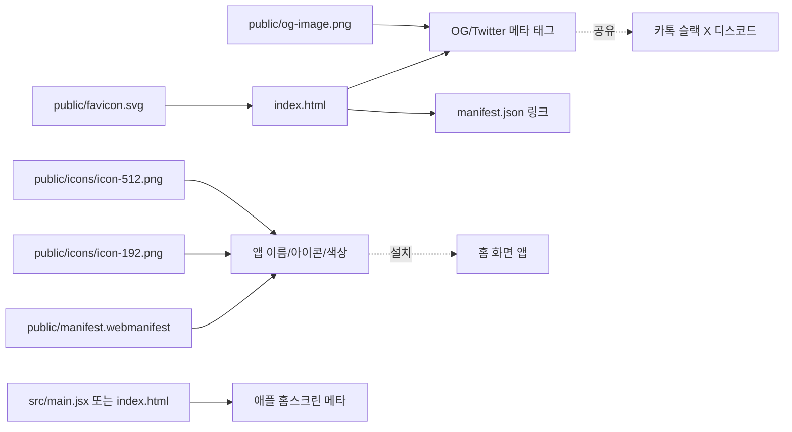
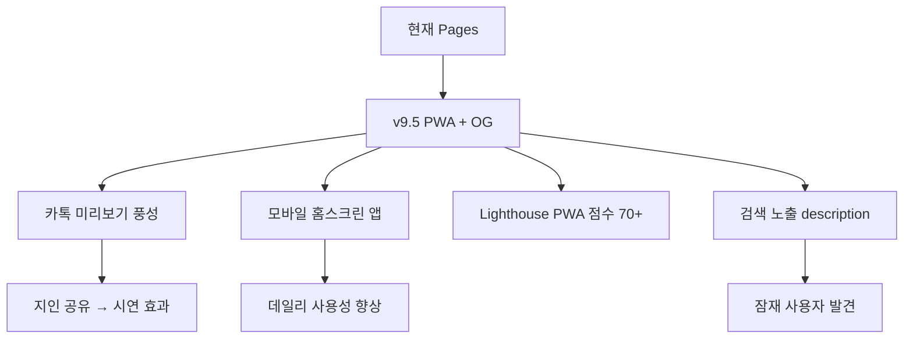

# 모바일 PWA + 공유 OG 메타 태그 플랜

작성일: 2026-04-08
상태: 초안

## Context

### 현재 상태
- GitHub Pages 배포 완료: https://ldh-mini.github.io/baseball-sim/
- 4개 탭 모두 동작 (가상대결/오늘의경기/누적적중률/백테스트)
- 매일 자동 데이터 갱신 인프라 구축
- 외부 접속 가능하지만 **공유 시 빈 미리보기**, **모바일에서 그냥 웹사이트 느낌**

### 문제점
1. **카톡/슬랙/SNS 공유 시 미리보기 없음** — index.html에 OG 메타 태그 부재. 링크를 보내도 URL만 덜렁 노출되어 클릭 유도 안 됨
2. **모바일 홈 화면 추가 시 안내 없음** — favicon 없음, manifest.json 없음, PWA 설치 불가능
3. **HTML title이 정적** — "KBO 경기 예측 시뮬레이터" 고정, 페이지 자체가 느낌 없음
4. **iOS Safari Add to Home Screen** 시 흰색 아이콘만 뜨고 어색함
5. **검색 엔진 색인 시 description 없음**

### 목표 상태
- 카톡/슬랙/디스코드/X에 링크 공유 시: 제목 + 설명 + 이미지가 풍성하게 표시
- 모바일에서 "홈 화면에 추가" → 아이콘 + 스플래시 + 풀스크린 모드로 앱처럼 동작
- 검색 노출도 향상 (실제 사용자 유입은 적겠지만 기록은 남음)
- 전체 작업 30분~1시간 내, 빌드 사이즈 영향 최소

### 성공 지표
- https://www.opengraph.xyz/ 에 URL 입력 시 제목/설명/이미지 표시
- iOS Safari "홈 화면에 추가" → 앱 아이콘 정상 표시
- Android Chrome → "앱 설치" 프롬프트 노출
- Lighthouse PWA 점수 80+ (필수 manifest 항목 모두 충족)

---

## 영향 범위



| 파일 | 변경 유형 | 설명 |
|------|----------|------|
| `index.html` | 수정 | OG/Twitter 메타 + manifest 링크 + Apple 태그 + favicon |
| `public/manifest.webmanifest` | **신규** | PWA manifest (name/icons/theme/display) |
| `public/favicon.svg` | **신규** | SVG 파비콘 (간단한 ⚾ 또는 텍스트) |
| `public/icons/icon-192.png` | **신규** | PWA 192x192 아이콘 |
| `public/icons/icon-512.png` | **신규** | PWA 512x512 아이콘 |
| `public/og-image.png` | **신규** | 1200x630 OG 공유 이미지 |
| `public/apple-touch-icon.png` | **신규** | iOS 180x180 |
| `vite.config.js` | 검토 | base path가 manifest 경로에 영향 — `start_url` 절대경로 처리 |
| `프로젝트_개요서.md` | (선택) | v9.5 섹션 추가 |

---

## 구현 단계

### 1단계: 아이콘/이미지 자산 생성

PNG 디자인 도구 없이 SVG → PNG 변환으로 처리. 가장 간단한 방법은 inline SVG를 만들고 빌드 시 sharp 또는 외부 변환 사용. 더 단순하게 — **순수 SVG favicon + 한 번만 손으로 만들어 commit**.

- [ ] **favicon.svg** 신규 작성 (`public/favicon.svg`)
  - 다크 배경 + ⚾ 이모지 또는 "KBO" 텍스트
  - 64×64 정도 viewBox, SVG 인라인이라 작음
- [ ] **icon-192.png / icon-512.png 생성**
  - 옵션 A: 온라인 favicon 생성기 (favicon.io, realfavicongenerator.net)
  - 옵션 B: Node 스크립트로 SVG→PNG (sharp 의존성)
  - 옵션 C: SVG만 사용, PNG는 manifest에서 제외 (브라우저 지원 점차 확대 중)
  - **권장**: 옵션 A로 한 번 만들고 commit
- [ ] **og-image.png 생성** (1200×630)
  - 다크 그라디언트 배경
  - 큰 텍스트: "KBO 경기 예측 시뮬레이터"
  - 작은 텍스트: "v9.4 · 베이지안 + 모멘텀 + 시점 백테스트"
  - 옵션 A: Figma/Canva 무료 템플릿
  - 옵션 B: ChatGPT/Claude로 SVG 코드 생성 후 변환
  - 옵션 C: 코드로 동적 OG 이미지 생성 (vercel/og 등) — 과함
- [ ] **apple-touch-icon.png** (180×180)
  - icon-192를 180으로 리사이즈

### 2단계: PWA manifest 작성

- [ ] `public/manifest.webmanifest` 신규
  ```json
  {
    "name": "KBO 경기 예측 시뮬레이터",
    "short_name": "KBO Sim",
    "description": "베이지안 블렌딩 + Layer 2C 모멘텀 + 시점기반 백테스트로 검증된 KBO 야구 경기 예측",
    "start_url": "/baseball-sim/",
    "scope": "/baseball-sim/",
    "display": "standalone",
    "orientation": "portrait-primary",
    "background_color": "#0f1729",
    "theme_color": "#7c3aed",
    "icons": [
      { "src": "/baseball-sim/icons/icon-192.png", "sizes": "192x192", "type": "image/png", "purpose": "any maskable" },
      { "src": "/baseball-sim/icons/icon-512.png", "sizes": "512x512", "type": "image/png", "purpose": "any maskable" }
    ],
    "categories": ["sports", "entertainment"],
    "lang": "ko"
  }
  ```
- [ ] `start_url`/`scope`/`icons[].src`는 `/baseball-sim/` prefix 필수 (Pages base path)
- [ ] 로컬 dev에서는 base가 `/`라서 manifest fetch 시 404 가능 — `vite-plugin-pwa` 또는 빌드 환경별 manifest 두 개 작성... **간단 우회**: manifest 경로를 `${BASE_URL}manifest.webmanifest`로 동적 link 삽입 (또는 두 환경 모두 절대경로 그대로 두고 dev에서는 단순히 동작 안 해도 OK)

### 3단계: index.html 메타 태그 추가

- [ ] OG 태그
  ```html
  <meta property="og:type" content="website" />
  <meta property="og:url" content="https://ldh-mini.github.io/baseball-sim/" />
  <meta property="og:title" content="KBO 경기 예측 시뮬레이터" />
  <meta property="og:description" content="베이지안 블렌딩 + Layer 2C 모멘텀 + 시점 백테스트로 검증된 KBO 예측. 매일 자동 갱신." />
  <meta property="og:image" content="https://ldh-mini.github.io/baseball-sim/og-image.png" />
  <meta property="og:image:width" content="1200" />
  <meta property="og:image:height" content="630" />
  <meta property="og:locale" content="ko_KR" />
  <meta property="og:site_name" content="baseball-sim" />
  ```
- [ ] Twitter Card
  ```html
  <meta name="twitter:card" content="summary_large_image" />
  <meta name="twitter:title" content="KBO 경기 예측 시뮬레이터" />
  <meta name="twitter:description" content="..." />
  <meta name="twitter:image" content="..." />
  ```
- [ ] 일반 SEO
  ```html
  <meta name="description" content="..." />
  <meta name="keywords" content="KBO,야구,예측,시뮬레이션,세이버메트릭스,몬테카를로" />
  <meta name="author" content="ldh-mini" />
  ```
- [ ] favicon
  ```html
  <link rel="icon" type="image/svg+xml" href="favicon.svg" />
  <link rel="apple-touch-icon" href="apple-touch-icon.png" />
  ```
- [ ] manifest 링크
  ```html
  <link rel="manifest" href="manifest.webmanifest" />
  <meta name="theme-color" content="#7c3aed" />
  ```
- [ ] iOS Safari 전용 태그
  ```html
  <meta name="apple-mobile-web-app-capable" content="yes" />
  <meta name="apple-mobile-web-app-status-bar-style" content="black-translucent" />
  <meta name="apple-mobile-web-app-title" content="KBO Sim" />
  ```

### 4단계: vite.config / public 처리

- [ ] vite는 `public/` 안의 모든 파일을 빌드 시 dist 루트로 복사 — 별도 설정 불필요
- [ ] base path `/baseball-sim/` 적용 시 index.html의 `<link href>`가 자동으로 prefix 처리되는지 확인
  - vite 기본: 상대 경로 (`favicon.svg`)는 base가 자동 prefix
  - 절대 경로 (`/favicon.svg`)는 수동으로 prefix 필요
- [ ] manifest.webmanifest 내부의 `start_url` 등은 vite가 처리하지 못하므로 **하드코딩** (`/baseball-sim/`)
  - 미래에 도메인 변경 시 manifest만 수정하면 됨

### 5단계: 동적 title (선택)

- [ ] React 컴포넌트가 마운트되면 `document.title` 갱신
- [ ] 탭별로 다른 title (예: "오늘의 경기 - KBO Sim")
- [ ] 효과는 미미하므로 우선순위 낮음

### 6단계: Lighthouse / 검증 도구

- [ ] Chrome DevTools → Lighthouse → PWA 카테고리 측정
  - Installable: 만족 필요 (manifest + icons + serviceWorker?)
  - PWA optimized: theme-color, viewport, apple-touch-icon
- [ ] **service worker는 이 단계에서 추가하지 않음** — vite-plugin-pwa 의존성 추가 + 캐시 정책 복잡, 추후 별도 작업
- [ ] OG 검증: https://www.opengraph.xyz/ 에 배포 URL 입력
- [ ] iOS 시뮬레이터/실기기에서 Safari → 공유 → 홈 화면에 추가 → 아이콘 확인
- [ ] Android Chrome → 메뉴 → "앱 설치" 노출 확인

### 7단계: README 갱신

- [ ] README.md에 PWA / 공유 안내 추가
  - 모바일에서 홈 화면에 추가하는 방법
  - OG 이미지 미리보기 캡처

### 8단계: 푸시 + Pages 자동 재배포

- [ ] 변경 파일 commit
- [ ] push 시 deploy-pages workflow 자동 트리거 (path filter에 `index.html` 포함됨, public/* 추가 필요)
- [ ] **추가 변경 필요**: deploy-pages workflow의 `paths`에 `public/**` 포함

---

## 리스크 / 주의사항

### 1. 아이콘/OG 이미지 생성 비용
- **문제**: 디자인 도구 없이 perfect 이미지 만들기 어려움
- **대응**: 미니멀한 다크 배경 + 큰 텍스트로 충분 (Figma 무료 또는 Canva 5분)
- **대응**: 임시로 단순 SVG → PNG (Node.js sharp + 텍스트 렌더링)

### 2. base path 절대경로 충돌
- **문제**: manifest의 `start_url`이 `/baseball-sim/`인데 로컬 dev (`/`)에서는 깨짐
- **대응**: 로컬 PWA 테스트는 production build 후 `npm run preview` 사용
- **대응**: dev 환경에서는 manifest 무시 (브라우저 콘솔 경고만 발생, 동작 영향 없음)

### 3. PWA Installable 요건
- **문제**: Chrome은 service worker가 없으면 "앱 설치" 프롬프트 안 띄움
- **대응**: 이번 작업에서는 manifest + icons만으로 "홈 화면 추가"는 가능 (수동 설치)
- **대응**: 본격 PWA는 v9.6 이후 vite-plugin-pwa 도입

### 4. 카톡 미리보기 캐시
- **문제**: 카톡은 OG를 한 번 캐시하면 며칠 동안 갱신 안 됨
- **대응**: 카카오 디벨로퍼 캐시 갱신 도구 (https://developers.kakao.com/tool/clear/og) 사용
- **대응**: og:image URL에 ?v=2 같은 쿼리 추가하여 새 이미지로 인식

### 5. SVG favicon 호환성
- **문제**: 구형 브라우저는 SVG favicon 미지원
- **대응**: PNG 대체본 함께 제공 (`<link rel="icon" type="image/png" href="...">`)

### 6. og-image 크기/품질
- **문제**: 1200×630 PNG는 100~300KB로 빌드 사이즈 증가
- **대응**: WebP 사용 (50% 절감) 또는 JPEG quality 80
- **대응**: og-image는 캐시되므로 한 번만 다운로드, 영향 미미

---

## 검증 방법

### 단위 검증
- [ ] 로컬 빌드: `GITHUB_PAGES=true npm run build` → `dist/manifest.webmanifest`, `dist/og-image.png`, `dist/icons/*` 존재
- [ ] `npm run preview` 후 브라우저에서 manifest 정상 로드 (DevTools → Application → Manifest)
- [ ] `<head>` 메타 태그 모두 viewport에 표시되는지 확인

### 외부 검증 (배포 후)
- [ ] **opengraph.xyz**: https://ldh-mini.github.io/baseball-sim/ 입력 → 카드 미리보기
- [ ] **카카오 디벨로퍼 OG 캐시**: https://developers.kakao.com/tool/clear/og
- [ ] **Twitter Card Validator**: https://cards-dev.twitter.com/validator (또는 X 자체 미리보기)
- [ ] **Facebook Sharing Debugger**: https://developers.facebook.com/tools/debug/
- [ ] 카톡 본인 채팅방에 링크 보내서 직접 확인

### PWA 검증
- [ ] Chrome DevTools → Lighthouse → PWA 카테고리 측정 → 점수 70+ 목표
- [ ] iOS Safari → 공유 → "홈 화면에 추가" → 아이콘이 KBO Sim으로 표시 / 풀스크린 동작
- [ ] Android Chrome → 메뉴 → "앱 설치" 또는 "홈 화면에 추가" 노출 확인

### 회귀 검증
- [ ] 기존 4개 탭 모두 정상 동작
- [ ] schedule-today.json 정적 fetch 정상
- [ ] 빌드 사이즈 증가 100KB 이하 (이미지 제외)

---

## 예상 산출물



### v9.6 후속 작업 후보
- vite-plugin-pwa 도입 → service worker + 오프라인 캐시
- 동적 OG 이미지 (예측 결과 포함)
- 카톡톡/디스코드 webhook 자동 알림
- 사용자 분석 (Plausible 무료 플랜)
