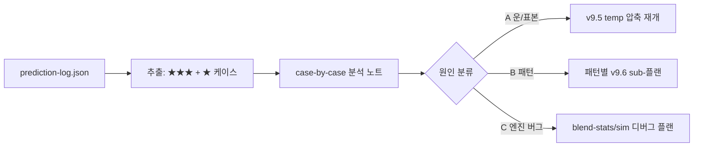
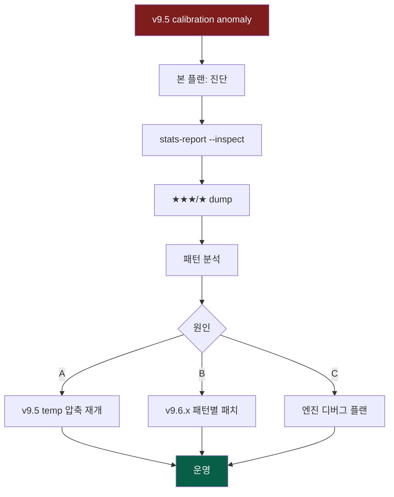

# v9.6 ★★★ Over-confident 케이스 진단 플랜

작성일: 2026-04-09
상태: 완료

## Context

### 배경

v9.5 calibration 분석([20260408_v95_calibration_검증_보정.md](20260408_v95_calibration_검증_보정.md))에서 **모델이 확신할수록 더 틀리는** anomaly가 확인되었다.

| 신뢰도 | 표본 | 적중률 | 직관 |
|--------|------|--------|------|
| ★★★ (60%+) | 12 | **33.3%** | ❌ 역전 |
| ★★ (55~60%) | 13 | 61.5% | ⚠️ 정상 |
| ★ (50~55%) | 17 | **82.4%** | ❌ 역전 |
| 전체 | 42 | 61.9% | — |

v9.5에서는 calibration 인프라(`stats-report.mjs --calibration`, [stats-report.mjs:214](stats-report.mjs#L214))를 만들고 **temperature 압축 적용은 보류** 상태. 이유는 두 가지:

1. 표본 부족(빈당 2~17개)으로 통계 결론이 약함
2. 단순 over-confidence가 아니라 **모델이 잘못된 신호를 학습**했을 가능성 — temperature 압축으로는 못 고침

### 목표 상태

**★★★ 12경기를 직접 들여다보고**, calibration 역전이 다음 중 어느 원인인지 진단한다:

- **(A) 단순 운/표본 부족** → temperature 압축으로 충분, v9.5 보류 해제
- **(B) 특정 패턴 오학습** (예: 사직 파크팩터 과대평가, 특정 선발투수 weight 폭주, 시즌초 최근10경기 가중치 노이즈) → 패턴별 별도 패치
- **(C) blend-stats / sim 엔진 버그** → 핵심 코드 디버그

진단 결과에 따라 v9.6 실제 작업 범위가 결정된다. **본 플랜은 진단 단계까지만**, 실제 fix는 별도 플랜으로 분기.

### 비목표

- 새로운 모델 feature 추가
- UI 변경
- temperature 압축 자체 적용 (v9.5 후속이며 진단 후 결정)

---

## 영향 범위

| 파일 | 변경 유형 | 설명 |
|------|----------|------|
| `stats-report.mjs` | 수정 | `--inspect <stars>` 모드: ★★★ / ★ 케이스 상세 dump |
| `Logs/Plans/20260409_v96_overconfident_케이스분석.md` | 신규 | 본 플랜 |
| `Logs/Analysis/20260409_starcase_dump.md` | 신규 | 케이스별 분석 노트 (산출물) |
| `프로젝트_개요서.md` | 수정 (선택) | v9.5 헤더 stale 갱신 + v9.6 진단 결과 섹션 |

`sim-today.mjs` / `blend-stats.mjs`는 **읽기만** 한다 (원인이 (C)로 확정되기 전까지 손대지 않음).

---

## 구현 단계

### 1단계: case dump 도구 추가

- [ ] `stats-report.mjs`에 `--inspect <stars>` 모드 추가 (예: `node stats-report.mjs --inspect 3` → ★★★ 케이스만)
- [ ] [stats-report.mjs:214](stats-report.mjs#L214) `calibrationReport` 구조 재사용 — 빈 분류 로직은 그대로
- [ ] 각 경기에 대해 다음 필드 출력:
  - 날짜 / 원정@홈 / 구장 / 선발투수 (away/home)
  - `predHomePct` / `predAwayPct` / `predWinner` / `confidence`
  - `actualHome` / `actualAway` / `hit`
  - 점수차 (실제 vs 예측 평균득점 차이)
- [ ] 정렬: hit=false 우선, 그 다음 |actualScore - avgScore| 큰 순
- [ ] 출력은 console + `--out <path>` 옵션으로 markdown 표 저장

### 2단계: ★★★ 12경기 dump

- [ ] `node stats-report.mjs --inspect 3 --version v9.2-mom --out Logs/Analysis/20260409_starcase_dump.md`
- [ ] ★ (50~55%) 케이스도 동일하게 dump → 비교용
- [ ] 각 경기에 대해 다음 컬럼을 수기로 채울 자리 만들기:
  - `의심 원인` (자유 텍스트)
  - `재현 방법` (sim-today --date YYYY-MM-DD 등)

### 3단계: 패턴 탐색

- [ ] **구장별 집계**: ★★★ 12경기 중 사직/잠실/창원/문학... 분포. 특정 구장 편향 확인
- [ ] **팀별 집계**: ★★★ 예측팀 / 실제 승팀 분포. 특정 팀이 반복적으로 underperform / overperform 하는지
- [ ] **선발투수별 집계**: ★★★ 예측의 우세 측 선발투수가 누구였는지. 신인/트레이드/복귀 선수 비율
- [ ] **점수차 분석**: avg score 예측 vs 실제. 모델이 일관되게 한쪽 득점을 과대평가하는가?
- [ ] **predHomePct 분포**: ★★★ 12개 중 60~65%, 65~70%, 70%+ 비율. 어느 구간이 가장 깨졌는가
- [ ] 발견한 패턴을 dump 파일 상단에 summary로 추가

### 4단계: 코드 측 가설 검증 (읽기만)

- [ ] `sim-today.mjs` 읽기 — confidence 산정 로직, MC 결과 → 확률 매핑
- [ ] `blend-stats.mjs` 읽기 — 최근 10경기 가중치([20260401_최근10경기가중치반영.md](20260401_최근10경기가중치반영.md)) 적용 부분
- [ ] 팀 레이팅 동적 업데이트([20260406_팀레이팅동적업데이트_선발투수자동감지.md](20260406_팀레이팅동적업데이트_선발투수자동감지.md)) 코드 흐름 확인
- [ ] **시즌초 1주차 효과** 가설: 4/1~4/7 데이터로 동적 업데이트되면서 표본 5경기 미만으로 weight가 폭주하는지 — 코드상 minimum sample 가드 유무 확인
- [ ] 발견한 의심 코드 위치를 `파일:line` 형식으로 dump 파일에 기록

### 5단계: 원인 분류 + 분기 결정

- [ ] dump + 패턴 분석을 종합해 (A)/(B)/(C) 중 하나로 분류
- [ ] **(A) 운/표본 부족 우세**:
  - v9.5 플랜의 5단계(temperature 압축) 재개 결정
  - 자동 누적 지속, 1~2주 후 재평가
- [ ] **(B) 특정 패턴 오학습 우세**:
  - 패턴별 별도 v9.6.x sub-플랜 생성 (예: `20260410_v96a_사직파크팩터.md`)
  - 우선순위 매기기
- [ ] **(C) 엔진 버그**:
  - 최소 재현 케이스 1개 확보
  - 별도 디버그 플랜 생성, 본 플랜과 링크
- [ ] 결정 사항을 본 플랜 파일 하단 "결론" 섹션에 추기

### 6단계: 문서화

- [ ] `Logs/Analysis/20260409_starcase_dump.md` 완성 (분석 결과 + 결론)
- [ ] `프로젝트_개요서.md` 헤더 v9.3 → v9.5 갱신 (현재 stale)
- [ ] 본 플랜 상태 `초안` → `완료` 또는 `분기됨`
- [ ] memory `project_baseball_sim_v95.md` 업데이트 — 진단 결과 한 줄 요약

---

## 리스크 / 주의사항

### 1. 표본이 너무 작아 패턴 자체가 노이즈일 수 있음

- **문제**: 12경기로 "사직 3건"이면 25%지만 실제 분포는 우연일 수 있음
- **대응**: 패턴 가설은 항상 "추가 데이터로 재검증 필요" 단서를 달고 기록
- **대응**: ★ (50~55%) 17경기와 비교했을 때 같은 패턴이 나오는지 cross-check

### 2. 코드 읽기만 하기로 했는데 "고치고 싶다" 충동

- **문제**: blend-stats에서 명백한 버그를 발견하면 즉시 패치하고 싶어짐
- **대응**: 본 플랜은 **진단 전용**. 발견한 버그는 별도 플랜으로 분리해야 v9.6 범위가 부풀지 않음
- **예외**: 1줄짜리 typo 수준이면 즉시 고치되 반드시 별도 커밋

### 3. dump 도구가 본 작업의 핵심이 되어버림

- **문제**: stats-report 리팩토링에 시간 쓰다가 실제 분석을 못 함
- **대응**: 1단계는 30분 이내, 안 되면 그냥 inline JS로 추출 (`node -e "..."`)

### 4. 자동 파이프라인이 매일 새 데이터를 추가함

- **문제**: 분석 중 prediction-log.json이 바뀌어 표본 수가 달라짐
- **대응**: 분석 시작 시점의 prediction-log.json snapshot을 `prediction-log.snapshot-20260409.json`으로 복사
- **대응**: 이후 dump 명령은 snapshot 파일을 인자로 받게

### 5. (C) 엔진 버그로 판명되면 v9.5 전체가 무의미해짐

- **문제**: temperature 압축은 잘못된 모델 출력을 가리는 cosmetic fix가 됨
- **대응**: 그것 자체가 본 진단의 가치 — v9.5 보류는 옳은 판단이었음을 입증
- **대응**: 그래도 calibration 인프라(stats-report)는 v9.6에서도 그대로 유효

---

## 검증 방법

### 단위 검증

- [ ] `node stats-report.mjs --inspect 3 --version v9.2-mom` → 12행 출력 (현재 표본 기준)
- [ ] `--out` 옵션으로 markdown 저장 시 표가 정상 렌더되는지 확인
- [ ] ★ (50~55%) dump도 17행으로 일치하는지

### 결과물 검증

- [ ] `Logs/Analysis/20260409_starcase_dump.md`에 다음이 모두 포함:
  - 12+17 케이스 표
  - 구장/팀/선발/점수차 집계
  - 의심 코드 위치 (파일:line)
  - (A)/(B)/(C) 분류와 근거
- [ ] 본 플랜 파일에 "결론" 섹션 추가됨
- [ ] 다음 작업이 무엇인지 명확 (별도 플랜 파일 링크 또는 v9.5 재개 결정)

### 회귀 검증

- [ ] `stats-report.mjs`의 기존 모드(`--calibration`, 기본 통계)가 정상 동작
- [ ] prediction-log.json snapshot 외에 원본 파일이 손상되지 않음

---

## 예상 산출물

### 후속 후보 (본 플랜 종료 후)

- (A 경로) v9.5 temperature 0.6 적용 + A/B 백테스트
- (B 경로) 사직 파크팩터 1.08 검증 / 시즌초 최근10경기 가드 추가 / 신인 선발 weight 보정
- (C 경로) blend-stats 단위 테스트 추가, sim-today MC 분포 시각화

---

## 결론 (2026-04-09 분석 완료)

### 원인 분류: **(B) 복합 곱셈에 의한 systematic over-confidence** + (A) 표본 부족

**진단 상세**: [Logs/Analysis/20260409_star3_dump.md](../Analysis/20260409_star3_dump.md) 참조

**주원인 (B)**: oddsMod × eloMod × recentForm × parkFactor가 곱셈으로 누적되어 60~75% 확률이 만들어지지만, 시즌초 각 factor의 신뢰도가 매우 낮음. 특히:
- 2025 prior가 77~83% 비중으로 지배 (w=g/30, 시즌초 5~7경기)
- 65~75% 구간 적중률 0/4 = 0% (가장 파괴적)
- 75%+ 구간은 2/3 = 67% (합리적) → 중간 구간이 문제

**부원인 (A)**: 12경기 표본으로 통계 결론은 약함. 누적 대기 필요.

### 권장 후속 작업 (우선순위 순)

1. **v9.5 temperature 압축 재개**: `--temp 0.7` → 65~75% 구간을 60% 미만으로 눌러 가짜 ★★★ 감소
2. **2025 prior 전환 속도**: `w = min(1.0, g/15)` (현재 30 → 15로 단축)
3. **★★★ threshold 상향**: 60% → 65% 또는 70%
4. **표본 50+ 시점 재분석** (1~2주 후)
