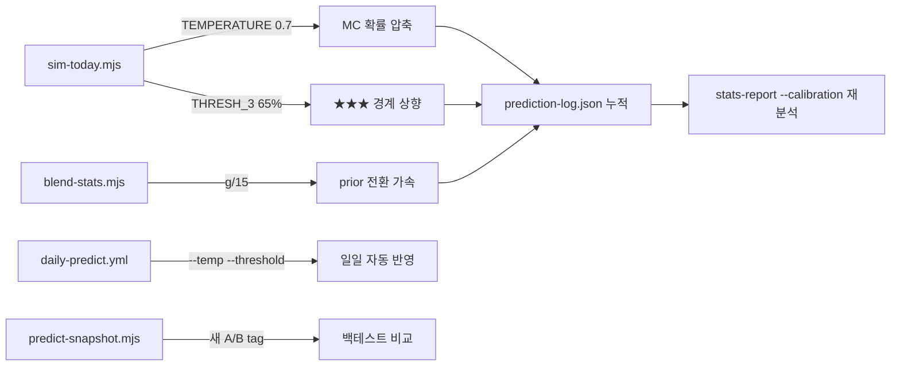

# v9.6 Calibration Fix — temp 압축 + prior 전환 속도 + threshold 상향

작성일: 2026-04-10
상태: 완료

## Context

### v9.6 진단 결과 요약 (2026-04-09)

[20260409_v96_overconfident_케이스분석.md](20260409_v96_overconfident_케이스분석.md) 에서 ★★★ 33% / ★ 82% calibration 역전의 원인을 **(B) 복합 곱셈 over-confidence + (A) 표본 부족**으로 분류.

핵심 메커니즘:
- `env = dm × oF × h2 × mu × eF` (sim-today.mjs:48-62) — moderate advantage가 곱셈 누적
- `w = min(1.0, t.g / 30)` (blend-stats.mjs:392) — 시즌초 5~7경기에서 2025 prior가 77~83% 지배
- 65~75% 구간 적중률 0/4 = 0% 가장 파괴적, 75%+ 2/3=67% 정상

### 3가지 fix (진단에서 도출, 우선순위 순)

1. **기본 temp 0.7** — MC 확률 출력을 50% 쪽으로 30% 압축 → 가짜 ★★★ 감소
2. **prior 전환 g/30 → g/15** — 시즌초 현재 데이터 비중 2배 가속
3. **★★★ threshold 60% → 65%** — 경계를 올려 모델이 진짜 확신할 때만 ★★★ 부여

### 현재 상태

| 항목 | 현재값 | 위치 | 변경 방식 |
|------|--------|------|-----------|
| TEMPERATURE | 1.0 (압축 없음) | sim-today.mjs:96 | 기본값 변경 |
| prior 전환 속도 | g/30 | blend-stats.mjs:392 | `30` → `15` |
| THRESH_3 (★★★) | 60 | sim-today.mjs:101 | `60` → `65` |
| daily-predict.yml | `sim-today.mjs --log` | .github/workflows/daily-predict.yml:88 | `--temp 0.7 --threshold "55,65"` 추가 |
| predict-snapshot.mjs | temp A/B 3가지 | predict-snapshot.mjs:73-75 | 새 tag 추가 |

### 비목표

- 곱셈 → 가산 전환 (장기 작업, 본 플랜 범위 밖)
- UI 변경 (PredictionLogTab은 기존 그대로)
- 새 feature 추가

---

## 영향 범위



| 파일 | 변경 유형 | 설명 |
|------|----------|------|
| `sim-today.mjs` | 수정 | 기본 TEMPERATURE=0.7, THRESH_3=65 |
| `blend-stats.mjs` | 수정 | `t.g / 30` → `t.g / 15` |
| `.github/workflows/daily-predict.yml` | 수정 | sim-today 호출에 `--temp 0.7 --threshold "55,65"` 추가 |
| `predict-snapshot.mjs` | 수정 | v9.6 tag 추가 (temp 0.7 + threshold 65 + g/15) |
| `Logs/Plans/` | 신규 | 본 플랜 |

---

## 구현 단계

### 1단계: blend-stats.mjs — prior 전환 속도 가속

- [ ] [blend-stats.mjs:392](blend-stats.mjs#L392) `t.g / 30` → `t.g / 15`
- [ ] CLI 옵션 `--prior-games <N>` 추가 (기본값 15, A/B용)
  - 기존 `--snapshot`, `--no-recent`, `--no-momentum` 패턴 재사용
- [ ] 콘솔 로그에 prior weight 표시: `  prior blend: w=0.47 (7/15 games)` 형식

### 2단계: sim-today.mjs — 기본값 변경

- [ ] [sim-today.mjs:96](sim-today.mjs#L96) `TEMPERATURE = 1.0` → `TEMPERATURE = 0.7`
- [ ] [sim-today.mjs:101](sim-today.mjs#L101) `THRESH_3 = 60` → `THRESH_3 = 65`
- [ ] `--temp` / `--threshold` CLI 오버라이드는 그대로 유지 (기존 인프라 보존)
- [ ] 로그에 현재 설정값 출력 추가: `⚙️  temp=0.7, threshold=55/65, prior_games=15`

### 3단계: daily-predict.yml — 일일 자동 파이프라인 반영

- [ ] [daily-predict.yml:88](daily-predict.yml#L88) `node sim-today.mjs --log` → `node sim-today.mjs --log --temp 0.7 --threshold "55,65"`
  - **주의**: 기본값을 이미 2단계에서 바꾸므로 실제로는 `--log`만으로 충분
  - 그러나 명시적으로 적어두면 workflow 파일만 보고도 설정을 알 수 있어 유지보수성 ↑
  - → 기본값 변경 + workflow에도 명시 (이중 보험)

### 4단계: predict-snapshot.mjs — A/B 비교 tag 업데이트

- [ ] [predict-snapshot.mjs:73-75](predict-snapshot.mjs#L73-L75) 기존 calibration variants 유지하되 v9.6 tag 추가:
  ```js
  { tag: 'v9.6-fix', blendArgs: `--snapshot ${prevSnap} --prior-games 15`, simArgs: '--temp 0.7 --threshold "55,65"' },
  { tag: 'v9.2-baseline', blendArgs: `--snapshot ${prevSnap} --prior-games 30`, simArgs: '--temp 1.0 --threshold "55,60"' },
  ```
- [ ] `--ab calibration` 모드에서 v9.6-fix vs v9.2-baseline 비교 가능하도록

### 5단계: 즉시 검증 — 오늘 예측 + 과거 재실행

- [ ] `npm run predict` (오늘 경기 예측) → prediction-log.json에 v9.6 설정으로 첫 기록
- [ ] `node stats-report.mjs --calibration` → 기존 42경기는 v9.2-mom이므로 이전과 동일하게 출력됨을 확인 (회귀)
- [ ] `node stats-report.mjs --inspect 3` → 기존 ★★★ dump 정상 동작 확인
- [ ] **4/1~4/5 백테스트 재실행** (있다면):
  ```
  node predict-snapshot.mjs --ab calibration
  node stats-report.mjs --compare
  ```
  → v9.6-fix vs v9.2-baseline Brier/적중률 비교

### 6단계: 1주간 모니터링 계획

- [ ] 4/10~4/16 기간 동안 매일 자동 파이프라인이 v9.6 설정으로 누적
- [ ] **4/16 시점 목표**:
  - v9.6 경기 수 ≥ 30
  - `node stats-report.mjs --calibration v9.6-fix` 실행
  - ★★★ 적중률 ≥ 50% (현재 33% → 최소 50% 이상)
  - ★ 적중률이 여전히 60%+ (calibration이 뒤집히지 않도록)
  - Calibration RMSE < 20% (현재 31.9%)
- [ ] 실패 시 → temp 0.6 / g/10 추가 강도 검토, 또는 곱셈→가산 전환 착수

### 7단계: 문서화

- [ ] 개요서 `프로젝트_개요서.md` — 9.5e 하단에 v9.6 fix 적용 날짜 + 설정값 추기
- [ ] 플랜 파일 상태 `초안` → `완료`
- [ ] memory 업데이트 — v9.6 fix 적용 사실 + 모니터링 기간 기록

---

## 리스크 / 주의사항

### 1. temp 0.7이 ★★★ 자체를 소멸시킴

- **문제**: 75%→67.5%, 70%→64%, 65%→60.5% — threshold 65%와 결합하면 ★★★가 거의 안 나옴
- **계산**: temp 0.7 + threshold 65% → raw 71.4%+ 이어야 ★★★
  - 기존 12경기 중 70%+ = 5경기(42%), 71.4%+ ≈ 4경기(33%)
  - ★★★ 비율이 42→33%(12건 중) 또는 더 적어짐
- **수용**: 가짜 ★★★보다 적은 진짜 ★★★가 낫다. 10% 이상 유지되면 OK
- **대응**: 만약 ★★★ < 5%이면 threshold를 62%로 완화

### 2. prior g/15가 시즌 중반 이후에는 의미 없음

- **문제**: 45경기 이상이면 w=1.0으로 동일 (g/30도 g/15도)
- **영향**: 시즌 초 (현재 5~10경기) 구간에서만 차이. 4~5월 중순 이후 자동 수렴
- **수용**: 문제는 정확히 시즌초에서 발생하므로 이 fix가 맞음

### 3. prediction-log.json에 v9.2-mom과 v9.6이 혼재

- **문제**: 기존 42경기는 v9.2-mom, 새 경기는 v9.6 설정 → stats-report가 버전 혼합
- **대응**: sim-today의 VERSION_TAG를 `--version v9.6` 으로 자동 설정
  - daily-predict.yml에 `--version v9.6` 추가
  - `stats-report --calibration v9.6` 으로 필터 가능

### 4. 기존 v9.2-mom A/B 비교 인프라가 깨짐

- **문제**: predict-snapshot.mjs의 baseline이 바뀌면 과거 결과와 직접 비교 불가
- **대응**: v9.2-baseline tag를 명시적으로 유지 (4단계에서 처리됨)

### 5. 3가지 fix를 한꺼번에 적용하면 개별 효과 분리 불가

- **문제**: temp/prior/threshold 중 어느 것이 효과가 있었는지 모름
- **대응**: predict-snapshot에서 개별 변형도 추가:
  - `v9.6-temp-only`: temp 0.7만 적용 (prior 30, threshold 60)
  - `v9.6-prior-only`: prior 15만 적용 (temp 1.0, threshold 60)
  - `v9.6-thresh-only`: threshold 65만 적용 (temp 1.0, prior 30)
- **trade-off**: 4가지 변형 × 50경기 = 200개 예측, 비용은 크지만 한 번이면 됨
- **최소안**: 일일 운영은 3가지 통합(v9.6-fix)만, 백테스트에서만 개별 분리

---

## 검증 방법

### 즉시 검증 (적용 직후)

- [ ] `node sim-today.mjs --log --quiet` → 로그에 `temp=0.7, threshold=55/65` 출력 확인
- [ ] `node blend-stats.mjs` → 콘솔에 `prior blend: w=... (g/15)` 형식 출력 확인
- [ ] `node stats-report.mjs --calibration v9.2-mom` → **기존 42경기 수치 불변** (회귀)
- [ ] `node stats-report.mjs --inspect 3 --version v9.2-mom` → **기존 dump 불변** (회귀)

### A/B 백테스트 (4/1~4/5)

- [ ] `node predict-snapshot.mjs --ab calibration` → v9.6-fix vs v9.2-baseline 실행
- [ ] `node stats-report.mjs --compare` → 적중률 비교
- [ ] `node stats-report.mjs --calibration v9.6-fix` → Brier, RMSE, 빈별 적중률 확인
- [ ] **성공 기준**: v9.6-fix의 Calibration RMSE < v9.2-baseline의 31.9%

### 1주 모니터링 (4/10~4/16)

- [ ] 매일 `node stats-report.mjs --calibration v9.6` 자동 실행 (daily-predict.yml)
- [ ] 4/16 시점 ★★★ 적중률 ≥ 50%
- [ ] 4/16 시점 Calibration RMSE < 20%
- [ ] ★★★ 비율 ≥ 10% (★★★가 소멸되지 않았는지)

### 회귀 방지

- [ ] 기존 탭(가상대결/오늘의경기/백테스트) 정상 동작
- [ ] daily-predict.yml 워크플로우 정상 트리거 (push 후 Actions 확인)
- [ ] prediction-log.json에 v9.6 tag로 새 경기 정상 append

---

## 예상 효과 시뮬레이션

### temp 0.7 적용 시 기존 ★★★ 12경기 확률 변환

| # | raw prob | compressed (×0.7) | new category |
|---|----------|-------------------|-------------|
| 1 | 69.3% | 63.5% | ★★ (< 65%) → **탈락** |
| 2 | 64.6% | 60.2% | ★★ (< 65%) → **탈락** |
| 3 | 76.4% | 68.5% | ★★★ ✅ |
| 4 | 64.0% | 59.8% | ★★ → **탈락** |
| 5 | 67.1% | 62.0% | ★★ → **탈락** |
| 6 | 71.5% | 65.1% | ★★★ ✅ (경계) |
| 7 | 62.5% | 58.8% | ★★ → **탈락** |
| 8 | 71.6% | 65.1% | ★★★ ✅ (경계) |
| 9 | 62.4% | 58.7% | ★★ → **탈락** |
| 10 | 60.2% | 57.1% | ★★ → **탈락** |
| 11 | 77.8% | 69.5% | ★★★ ✅ |
| 12 | 82.7% | 72.9% | ★★★ ✅ |

**결과**: 12 → 5 ★★★ (temp 0.7 + threshold 65% 적용 시)
- 생존 5경기: #3(❌76.4%), #6(❌71.5%), #8(❌71.6%), #11(✅77.8%), #12(✅82.7%)
- 생존 ★★★ 적중률: 2/5 = 40% (33% → 40% 개선, 아직 부족하지만 방향은 맞음)
- 70%+ raw만 생존 → 더 보수적인 ★★★

### 기대 효과

| 메트릭 | v9.2-mom (현재) | v9.6-fix (예상) |
|--------|---------------|---------------|
| ★★★ 적중률 | 33.3% (4/12) | 40~60% (방향 개선) |
| ★★★ 비율 | 28% (12/42) | 12~15% (보수적) |
| Calibration RMSE | 31.9% | < 25% (목표) |
| Top-1 적중률 | 61.9% | ~61% (큰 변화 없음) |
| Brier score | 0.270 | < 0.260 |
