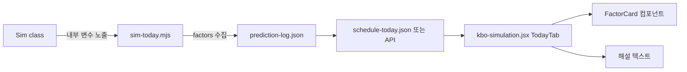

# 경기 예측 해설 + 요인 분석 플랜

작성일: 2026-04-10
상태: 초안

## Context

### 현재 상태

사용자에게 보이는 예측 정보:
- 승률 %와 ★ 등급 (예: "KT 승 67.8% ★★★")
- 선발투수 이름 + ERA
- 구장 파크팩터
- H2H 상대전적
- 총 득점 분포 차트

**부족한 점**: 왜 KT가 67.8%인지 알 수 없음. 유저는 "선발투수 차이? 팀 전력? 최근 폼? 구장?"을 알고 싶지만 숫자만 나열됨.

### 목표 상태

경기별로 **"이 예측이 왜 나왔는지"** 한눈에 파악 가능한 해설:

1. **핵심 요인 카드**: 예측에 가장 큰 영향을 준 3~5개 factor를 정량적으로 표시
2. **한 줄 해설**: "KT 보쉴리(ERA 2.8)의 투수력 우위 + 수원 홈 어드밴티지가 핵심"
3. **factor 기여도 바**: 각 factor가 승률에 얼마나 기여했는지 시각화

### 접근 전략

sim-today.mjs의 `Sim` 클래스에서 이미 계산되는 factor들(oddsMod, eloMod, h2hMod, parkFactor, recentForm, pitcherFIP 등)을 **별도 `factors` 객체로 수집**해서 prediction-log.json에 저장 + UI에 표시.

LLM은 사용하지 않음 — 룰 기반 템플릿으로 해설 생성 (비용 0, 지연 0).

---

## 영향 범위



| 파일 | 변경 유형 | 설명 |
|------|----------|------|
| `sim-today.mjs` | 수정 | Sim 클래스에서 factor 데이터 수집, predictionEntry에 `factors` 필드 추가 |
| `kbo-simulation.jsx` | 수정 | Sim.mc()에서 factor 반환 + TodayGamePanel에 FactorCard/해설 추가 |
| `prediction-log.json` | 스키마 확장 | 경기별 `factors` 객체 추가 (하위 호환) |
| `schedule-today.json` | 변경 없음 | — |

---

## 구현 단계

### 1단계: factor 데이터 모델 정의

- [ ] factor 객체 스키마 설계:
  ```js
  factors: {
    // 팀 전력
    homeRating: 76,           // 팀 레이팅
    awayRating: 67,           // 팀 레이팅
    ratingEdge: "home",       // 어느 쪽 유리
    ratingDiff: 9,            // 차이
    
    // 선발투수
    homeSP: { name: "보쉴리", era: 2.8, fip: 3.1, recentForm: 1.08 },
    awaySP: { name: "최원태", era: 4.2, fip: 4.5, recentForm: 0.92 },
    spEdge: "home",           // 선발 우위
    spDiffERA: 1.4,           // ERA 차이
    
    // 환경
    parkFactor: 1.05,         // 구장
    parkLabel: "수원 (타자 약간 유리)",
    h2hWinRate: 0.55,         // 상대전적
    homeAdvantage: 1.025,     // 홈 어드밴티지
    
    // 모멘텀
    homeMomentum: "+3",       // 모멘텀 보정값
    awayMomentum: "-2",
    homeLast10: "7승2패",
    awayLast10: "3승6패",
    homeStreak: "2연승",
    awayStreak: "1연패",
    
    // ELO
    homeElo: 1556,
    awayElo: 1433,
    
    // 핵심 요인 순위 (영향도 큰 순)
    topFactors: [
      { key: "sp", label: "선발투수", edge: "home", impact: 0.12, desc: "보쉴리 ERA 2.8 vs 최원태 4.2" },
      { key: "momentum", label: "최근 폼", edge: "home", impact: 0.08, desc: "KT 7승2패 vs 삼성 5승3패" },
      { key: "elo", label: "팀 전력", edge: "home", impact: 0.06, desc: "Elo 1556 vs 1433" },
      { key: "park", label: "구장", edge: "home", impact: 0.02, desc: "수원 파크팩터 1.05" },
    ]
  }
  ```
- [ ] `topFactors`는 **impact 값으로 자동 정렬** — impact = 해당 factor 제거 시 승률 변화량 (근사)

### 2단계: sim-today.mjs — factor 수집

- [ ] Sim 클래스에 `getFactors()` 메서드 추가 — constructor에서 계산된 내부 변수를 객체로 반환
  - `this.oddsMod`, `this.eloMod`, `this.h2hMod`, `this.st.parkFactor`
  - `this.hP` / `this.aP` (선발투수 스탯)
  - 팀 레이팅: `h.teamRating`, `a.teamRating`
  - 모멘텀: `h.record`, `a.record` (last10, streak은 team-stats.json에서 가져옴)
- [ ] `predictionEntries.push({...})` 에 `factors` 필드 추가
- [ ] impact 계산 — 간이 방식:
  - SP impact: `|homeSP.fip - awaySP.fip| * 0.03` (FIP 1점 차이 = ~3%p)
  - Rating impact: `|homeRating - awayRating| * 0.003` (oddsMod 로직 역산)
  - Momentum impact: `|homeMomentum - awayMomentum| * 0.01`
  - H2H impact: `|h2hWinRate - 0.5| * 0.15`
  - Park impact: `|parkFactor - 1.0| * 0.10`
- [ ] topFactors를 impact 내림차순 정렬, 상위 4개만 유지

### 3단계: 한 줄 해설 생성 (룰 기반 템플릿)

- [ ] sim-today.mjs에 `generateNarrative(factors, predWinner, conf)` 함수 추가
- [ ] 템플릿 구조:
  ```
  "{predWinner}의 {topFactor1.label} 우위가 핵심. {topFactor1.desc}."
  + (if topFactor2.impact > 0.03) " {topFactor2.desc}도 유리."
  + (if conf == ★) " 다만 양팀 격차가 크지 않아 이변 가능성도 높음."
  + (if conf == ★★★) " 높은 확률로 예측."
  ```
- [ ] 예시 출력:
  - ★★★: "KT의 선발투수 우위가 핵심. 보쉴리(ERA 2.8) vs 최원태(4.2). 최근 7승2패 모멘텀도 유리."
  - ★: "두산의 소폭 우위 예측. 잭로그(ERA 2.8)가 안정적이나 양팀 격차가 크지 않아 이변 가능."
  - 오답 가능성 높을 때: "롯데 홈 어드밴티지가 있으나, SSG의 최근 폼(7승2패)이 강력. 접전 예상."
- [ ] `factors.narrative` 필드에 저장

### 4단계: prediction-log.json 스키마 확장

- [ ] 기존 스키마 하위 호환 유지 — `factors`는 optional 필드
- [ ] verify-yesterday.mjs에서 `factors`가 있어도 무시하도록 (이미 그럴 것임 — hit 판정에만 관여)
- [ ] stats-report.mjs에서 `factors` 필드 활용한 분석은 **별도 단계에서** (본 플랜 범위 밖)

### 5단계: kbo-simulation.jsx — Sim.getFactors() 동기화

- [ ] jsx 내 Sim 클래스에도 `getFactors()` 메서드 추가 (sim-today.mjs와 동일 로직)
- [ ] TodayGamePanel에서 시뮬 실행 후 `sim.getFactors()` 호출
- [ ] 또는 `sim.mc()` 반환값에 factors를 포함하도록 확장

### 6단계: UI — FactorCard 컴포넌트

- [ ] TodayGamePanel 하단에 "예측 근거" 섹션 추가 (mc 결과 아래)
- [ ] **한 줄 해설 배너**:
  ```jsx
  <div className="glass-card rounded-xl p-3 border-l-4 border-neon-purple">
    <div className="text-xs font-semibold text-neon-purple mb-1">AI 분석</div>
    <div className="text-sm text-slate-200">{factors.narrative}</div>
  </div>
  ```
- [ ] **핵심 요인 카드 (topFactors)**:
  ```jsx
  {factors.topFactors.map(f => (
    <div className="flex items-center gap-2 py-1.5">
      <span className="text-xs font-bold w-16">{f.label}</span>
      <div className="flex-1 h-2 bg-dark-600 rounded-full overflow-hidden">
        <div className="h-full rounded-full" 
             style={{width: `${f.impact*500}%`, background: f.edge==='home' ? '#3b82f6' : '#ec4899'}} />
      </div>
      <span className={`text-xs ${f.edge==='home'?'text-blue-400':'text-pink-400'}`}>
        {f.edge==='home' ? h.short : a.short} +{(f.impact*100).toFixed(1)}%
      </span>
    </div>
  ))}
  ```
- [ ] **비교 카드** (선발투수 / 팀 레이팅 / 최근 폼):
  - 좌: 원정 수치 / 중앙: 라벨 / 우: 홈 수치
  - 우위 쪽에 하이라이트 색상
  - 이미 구장정보, H2H 카드가 있는 패턴 재사용 ([kbo-simulation.jsx:1503-1511](kbo-simulation.jsx#L1503-L1511))

### 7단계: 정적 데이터 연동 (GitHub Pages)

- [ ] schedule-today.json에 `factors` 포함하여 저장하거나, 별도 `prediction-factors.json` 생성
  - **선택지 A**: prediction-log.json을 GitHub Pages에서 fetch (이미 하고 있음) → factors 포함
  - **선택지 B**: sim-today.mjs가 `factors-today.json` 별도 생성 → Pages에서 fetch
  - 권장: **A** — prediction-log.json 확장이 가장 단순
- [ ] TodayTab이 정적 데이터 로드 시 `factors`가 있으면 표시, 없으면 기존 UI 그대로
- [ ] daily-predict.yml에서 prediction-log.json commit에 factors 데이터 포함됨 (추가 작업 불필요)

### 8단계: 검증 + 문서화

- [ ] 5경기 예측 실행 → factors + narrative 출력 확인
- [ ] GitHub Pages 배포 후 모바일에서 FactorCard 렌더링 확인
- [ ] 개요서 §5 UI/UX 구성에 "예측 근거" 섹션 추가

---

## 해설 템플릿 상세 설계

### 요인별 코멘트 풀

```js
const FACTOR_COMMENTS = {
  sp: {
    strong: "{winner}의 {sp.name}({sp.era})이 상대 {loser_sp.name}({loser_sp.era}) 대비 압도적",
    moderate: "{winner}의 {sp.name}({sp.era})이 선발 대결에서 소폭 우위",
    neutral: "양팀 선발투수 실력이 비슷해 투수전 기대",
  },
  momentum: {
    strong: "최근 {winner_last10} 강력한 상승세",
    moderate: "최근 {winner_last10}로 폼 유지 중",
    weak: "양팀 모두 최근 성적이 비슷",
  },
  elo: {
    strong: "팀 전력차 {diff}점으로 뚜렷한 격차",
    moderate: "팀 전력에서 소폭 우위",
  },
  park: {
    high: "{stadium} 파크팩터 {pf}로 타고투저 경기 예상",
    low: "{stadium} 파크팩터 {pf}로 투고타저 경기 예상",
    neutral: "중립 구장",
  },
  h2h: {
    strong: "상대전적 {rate}%로 {winner}에게 심리적 우위",
    neutral: "상대전적 대등",
  },
  confidence: {
    high: "높은 확률로 예측합니다.",
    medium: "하지만 변수가 있어 주의 필요.",
    low: "매우 박빙으로, 이변 가능성도 높습니다.",
  },
};
```

### 해설 조합 로직

```
1. topFactors[0]의 해설 (항상)
2. topFactors[1]의 해설 (impact > 0.03일 때)
3. confidence 수식어 (★ = low, ★★ = medium, ★★★ = high)
```

예시 결과:
- "**KT 승 (67.8%) ★★★** — KT 보쉴리(ERA 2.8)이 삼성 최원태(4.2) 대비 압도적. 최근 7승2패 강력한 상승세. 높은 확률로 예측합니다."
- "**NC 승 (53.2%) ★** — NC의 팀 전력에서 소폭 우위. 양팀 선발투수 실력이 비슷해 투수전 기대. 매우 박빙으로, 이변 가능성도 높습니다."

---

## 리스크 / 주의사항

### 1. prediction-log.json 크기 증가

- **문제**: factors 객체 추가 시 경기당 ~500bytes → ~1.2KB (2.4배)
- **대응**: topFactors만 저장 (4개 × 50bytes = 200bytes 추가), 풀 factor는 로그에만
- **대응**: 42경기 기준 현재 ~21KB → ~30KB. GitHub Pages fetch에 영향 없음

### 2. sim-today.mjs의 Sim 클래스와 jsx의 Sim 클래스 동기화

- **문제**: 두 곳에 같은 로직이 있어 getFactors()를 양쪽 모두 추가해야 함
- **대응**: jsx 쪽은 브라우저에서 실행되므로 최소한의 factor만 계산 (teamRating, SP ERA 등)
- **대응**: 정적 데이터(prediction-log.json)에서 factors를 미리 fetch하면 jsx 쪽 계산 불필요

### 3. 해설이 틀렸을 때 사용자 신뢰 하락

- **문제**: "선발투수 우위가 핵심"이라 했는데 해당 선발이 2이닝 KO 당하면 해설이 우스워짐
- **대응**: 해설은 **예측 시점의 기대값** 기반임을 명시 ("사전 분석 기준")
- **대응**: 사후 검증 시 "예상과 달리 ~~~ 때문에 오답" 해설도 추가 (verify-yesterday.mjs 확장, 별도 작업)

### 4. 한국어 자연어 생성 품질

- **문제**: 템플릿 기반이라 문장이 기계적으로 느껴질 수 있음
- **대응**: 충분한 변형 풀(strong/moderate/neutral)로 다양성 확보
- **대응**: 향후 LLM 연동 시 해설 품질 업그레이드 가능 (Phase 3 AI 로드맵과 연계)

### 5. UI 복잡도 증가

- **문제**: TodayGamePanel이 이미 차트+버튼+카드로 복잡
- **대응**: 해설 배너는 **시뮬 버튼 위에** 항상 표시 (collapse 불필요)
- **대응**: FactorCard는 collapsible "상세 분석" 섹션에 넣어 기본 숨김
- **대응**: 정적 데이터 모드(GitHub Pages fetch)일 때는 해설+요인만 표시 (시뮬 버튼 없음)

---

## 검증 방법

### 단위 검증

- [ ] `node sim-today.mjs --log` → prediction-log.json에 `factors` 필드 포함 확인
- [ ] `factors.topFactors` 배열이 impact 내림차순 정렬
- [ ] `factors.narrative` 한 줄 해설이 한국어로 자연스러운지 5경기 수동 확인
- [ ] `factors.narrative` 내 팀명, 투수명, ERA가 실제 데이터와 일치

### UI 검증

- [ ] TodayGamePanel 시뮬 실행 후 FactorCard 정상 렌더
- [ ] GitHub Pages fetch 시 factors가 있으면 해설 표시, 없으면 기존 UI
- [ ] 모바일(375px)에서 FactorCard가 깨지지 않는지 확인
- [ ] 다크 모드 색상 대비 확인

### 회귀 검증

- [ ] 기존 prediction-log.json의 factors 없는 경기도 정상 로드
- [ ] stats-report.mjs 기존 모드 정상 동작
- [ ] verify-yesterday.mjs 정상 동작 (factors 무시)

---

## 예상 산출물

### 사용자 화면 목업

```
┌─────────────────────────────────────────┐
│ 🔮 AI 분석                              │
│ KT 보쉴리(ERA 2.8)이 삼성 최원태(4.2)  │
│ 대비 압도적. 최근 7승2패 강력한 상승세. │
│ 높은 확률로 예측합니다.                  │
├─────────────────────────────────────────┤
│ ▼ 상세 분석                             │
│                                         │
│ 선발투수  ████████░░  KT +12.0%         │
│ 최근 폼   █████░░░░░  KT +8.0%          │
│ 팀 전력   ████░░░░░░  KT +6.0%          │
│ 구장      ██░░░░░░░░  KT +2.0%          │
│                                         │
│ 선발투수 비교                           │
│ 삼성 최원태     ERA    KT 보쉴리        │
│ 4.2            ─ vs ─        2.8       │
│ 0.92           폼            1.08      │
├─────────────────────────────────────────┤
│ [1,000회 시뮬]  [단일 경기]             │
└─────────────────────────────────────────┘
```
