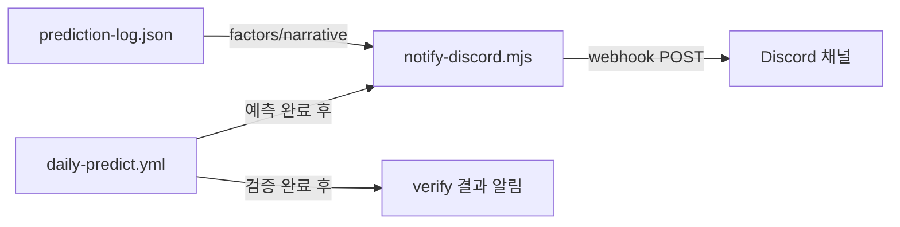

# 다음 작업 플랜 — 일일 예측 알림 + GitHub Pages 배포 트리거

작성일: 2026-04-10
상태: 초안

## Context

### 완료된 작업

| 버전 | 내용 | 상태 |
|------|------|------|
| v9.6 fix | temp 0.7 + prior g/15 + threshold 65% | ✅ 적용, 모니터링 중 |
| v9.6 해설 | Sim.getFactors() + generateNarrative() + FactorCard UI | ✅ 커밋 완료 |
| 자동 파이프라인 | daily-predict.yml 09/17시 KST verify+predict | ✅ 동작 중 |
| GitHub Pages | deploy-pages.yml + PWA + OG 메타 | ✅ 배포 중 |

### 현재 상태

- 일일 자동 예측이 돌아가고 있지만 **사용자가 직접 Pages에 접속해야** 결과를 볼 수 있음
- 예측 결과 + 해설이 prediction-log.json에 누적되지만 **push 알림이 없음**
- v9.6 calibration fix의 효과를 모니터링 중 (4/16까지 대기)

### 다음 작업 후보 평가

| 작업 | 사용자 임팩트 | 난이도 | 시간 | 우선순위 |
|------|-------------|--------|------|----------|
| **Discord 일일 알림** | ★★★ 높음 — 매일 push 받기 | 낮음 | 1~2시간 | **1위** |
| verify 결과 사후 해설 | ★★ 중간 | 중간 | 2~3시간 | 2위 |
| LLM 연동 해설 고도화 | ★★ 중간 | 높음 | 4~6시간 | 3위 |
| 모니터링 재분석 | ★ 낮음 (4/16까지 대기) | 낮음 | 30분 | 대기 |
| 모멘텀 가중치 튜닝 | ★ 낮음 (표본 부족) | 중간 | 3시간 | 대기 |

**결론**: Discord webhook 일일 알림이 가장 높은 ROI.

---

## 영향 범위



| 파일 | 변경 유형 | 설명 |
|------|----------|------|
| `notify-discord.mjs` | **신규** | Discord webhook 알림 스크립트 |
| `.github/workflows/daily-predict.yml` | 수정 | 예측/검증 후 알림 step 추가 |
| `.env` / GitHub Secrets | 설정 | `DISCORD_WEBHOOK_URL` 시크릿 |

---

## 구현 단계

### 1단계: Discord 서버 + 웹훅 설정

- [ ] Discord 서버에 `#kbo-predictions` 채널 생성 (또는 기존 채널 활용)
- [ ] 채널 설정 → 연동 → 웹훅 → "KBO 예측 봇" 생성
- [ ] 웹훅 URL 복사
- [ ] GitHub repo Settings → Secrets → `DISCORD_WEBHOOK_URL` 추가

### 2단계: notify-discord.mjs 구현

- [ ] prediction-log.json에서 오늘 예측 읽기
- [ ] Discord Embed 메시지 포맷:
  ```
  🔮 KBO 예측 — 2026-04-10 (v9.6)

  ⚾ 한화 @ 두산 (잠실 18:30)
  ▶ 두산 승 (54.7%) ★
  💬 잭로그(ERA 2.81) vs 황준서(3.88), 선발 대결에서 두산 우위.

  ⚾ SSG @ 롯데 (부산 18:30)
  ▶ 롯데 승 (65.2%) ★★★
  💬 사직야구장 홈 구장 효과가 롯데에게 유리.

  ...
  📊 전체 적중률: 61.9% (26/42)
  ```
- [ ] verify 모드: 어제 결과 검증 알림
  ```
  ✅ 어제 결과 검증 — 2026-04-09
  
  ⚾ 한화 @ 두산: 두산 예측 → 두산 5-3 ✅
  ⚾ SSG @ 롯데: 롯데 예측 → SSG 4-2 ❌
  ...
  📊 어제 적중: 3/5 (60%) | 누적: 29/47 (61.7%)
  ```
- [ ] Discord Embed 색상: 적중률 60%+ = green, 50~60% = yellow, <50% = red
- [ ] 에러 시 알림 스킵 (webhook 실패로 파이프라인 실패 방지)
- [ ] `--mode predict|verify` CLI로 모드 구분

### 3단계: daily-predict.yml 통합

- [ ] predict 완료 후 `notify-discord.mjs --mode predict` step 추가
- [ ] verify 완료 후 `notify-discord.mjs --mode verify` step 추가
- [ ] `DISCORD_WEBHOOK_URL` 환경변수 주입 (GitHub Secrets)
- [ ] `continue-on-error: true` — 알림 실패 시 파이프라인 정상 진행

### 4단계: 검증

- [ ] `workflow_dispatch`로 수동 실행 → Discord 채널에 메시지 수신 확인
- [ ] Embed 포맷 (모바일/데스크톱) 확인
- [ ] 한국어 깨짐 없는지 확인
- [ ] webhook URL이 시크릿으로 노출 안 되는지 확인

---

## notify-discord.mjs 상세 설계

```js
// 사용법: node notify-discord.mjs --mode predict|verify
// 환경변수: DISCORD_WEBHOOK_URL

import fs from 'fs';

const WEBHOOK_URL = process.env.DISCORD_WEBHOOK_URL;
const mode = process.argv.includes('--mode') 
  ? process.argv[process.argv.indexOf('--mode') + 1] 
  : 'predict';

const log = JSON.parse(fs.readFileSync('prediction-log.json', 'utf8'));
const today = new Date().toISOString().split('T')[0];

if (mode === 'predict') {
  // 오늘 예측 결과 → Embed
  const entry = log.predictions.find(p => p.date === today && p.version.startsWith('v9'));
  if (!entry) { console.log('오늘 예측 없음'); process.exit(0); }

  const lines = entry.games.map(g => {
    const narr = g.factors?.narrative || '';
    return `⚾ **${g.away} @ ${g.home}** (${g.stadium} ${g.time})\n▶ ${g.predWinner} 승 (${Math.max(g.predHomePct,g.predAwayPct)}%) ${g.confidence}\n${narr ? `💬 ${narr}` : ''}`;
  });

  const embed = {
    title: `🔮 KBO 예측 — ${today} (${entry.version})`,
    description: lines.join('\n\n'),
    color: 0x8B5CF6, // purple
    footer: { text: 'baseball-sim | GitHub Pages' },
  };

  await fetch(WEBHOOK_URL, {
    method: 'POST',
    headers: { 'Content-Type': 'application/json' },
    body: JSON.stringify({ embeds: [embed] }),
  });

} else if (mode === 'verify') {
  // 어제 검증 결과 → Embed
  // ...similar logic with hit/miss counting
}
```

---

## 리스크 / 주의사항

### 1. Discord 웹훅 URL 노출

- **문제**: URL이 코드에 하드코딩되면 public repo에서 악용 가능
- **대응**: GitHub Secrets (`DISCORD_WEBHOOK_URL`)로만 관리, 코드에 절대 하드코딩 안 함

### 2. Embed 글자 수 제한

- **문제**: Discord Embed description은 4096자 제한. 5경기 × 해설 = ~500~800자로 여유
- **대응**: 10경기 이상일 때는 요약 모드 (해설 생략, 결과만)

### 3. 웹훅 rate limit

- **문제**: Discord 웹훅은 5초에 1회 제한
- **대응**: 하루 2회(09시/17시)만 호출하므로 문제 없음

### 4. 경기 없는 날

- **문제**: 월요일 등 경기 없는 날 빈 알림
- **대응**: 예측 0건이면 알림 스킵

### 5. Slack도 필요한 경우

- **문제**: Discord 대신/추가로 Slack도 필요할 수 있음
- **대응**: 메시지 포맷팅 함수를 분리하고 발송부만 교체 가능하게 설계
- **대응**: Slack Incoming Webhook도 거의 동일한 POST 방식 → 인터페이스 동일

---

## 검증 방법

### 기능 검증

- [ ] `node notify-discord.mjs --mode predict` → Discord 채널에 예측 Embed 수신
- [ ] `node notify-discord.mjs --mode verify` → Discord 채널에 검증 Embed 수신
- [ ] Embed에 한국어 정상 표시, factors.narrative 포함
- [ ] 경기 없는 날 → 알림 스킵, 에러 아님

### 파이프라인 검증

- [ ] `workflow_dispatch` → predict → 알림 → commit 정상 완료
- [ ] webhook 실패 시 파이프라인 정상 진행 (continue-on-error)
- [ ] DISCORD_WEBHOOK_URL 없을 때 graceful skip

### 회귀 검증

- [ ] daily-predict.yml 기존 step 정상 동작
- [ ] prediction-log.json 정상 append
- [ ] deploy-pages 트리거 정상
