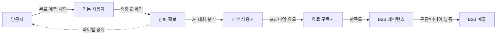
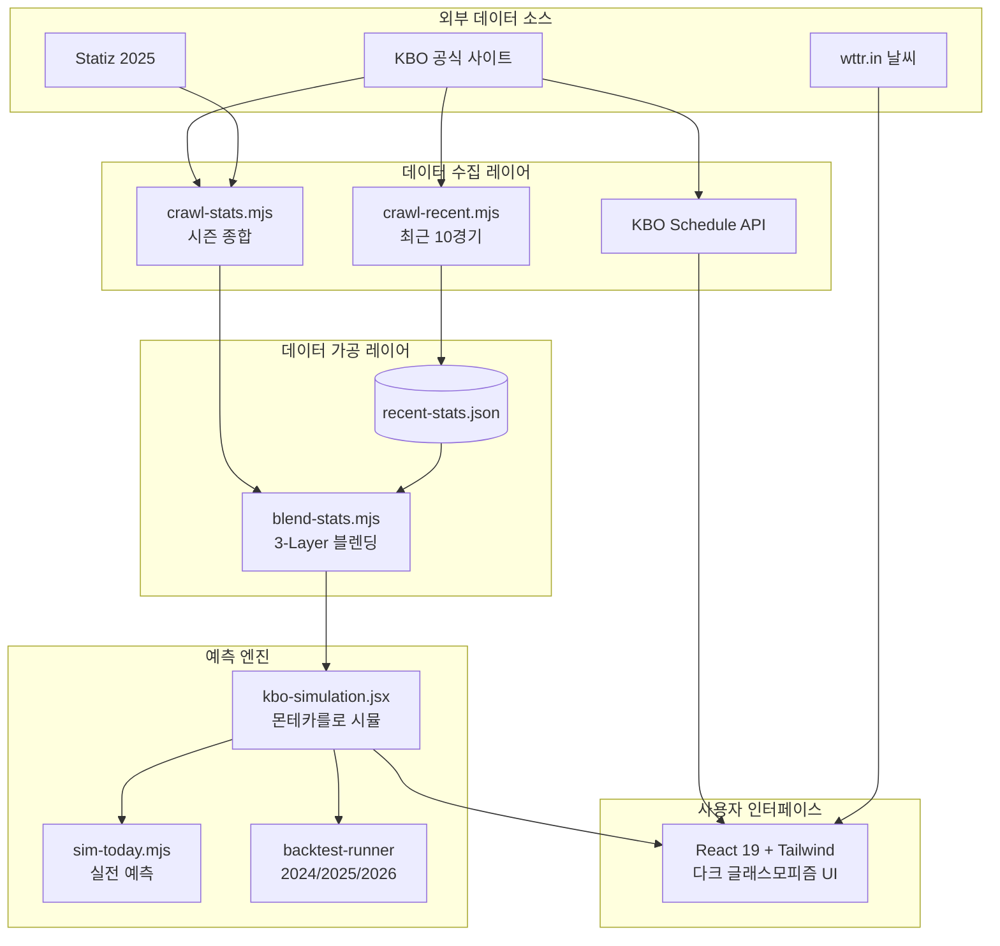
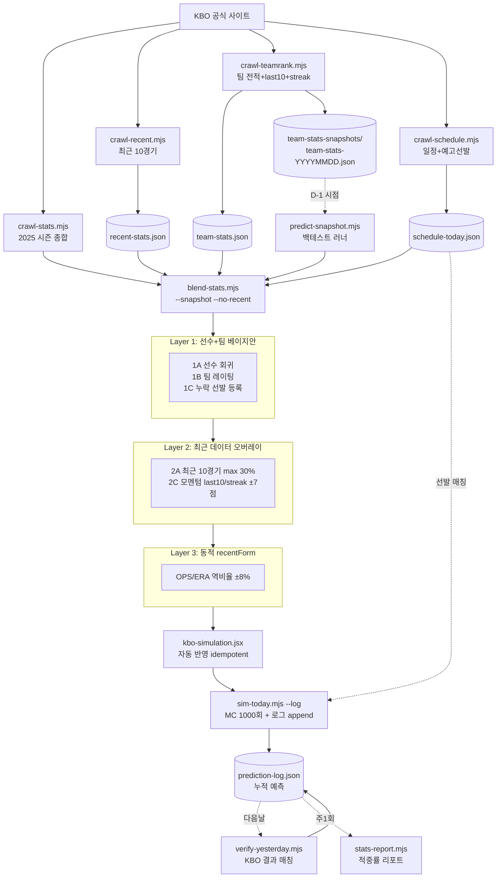
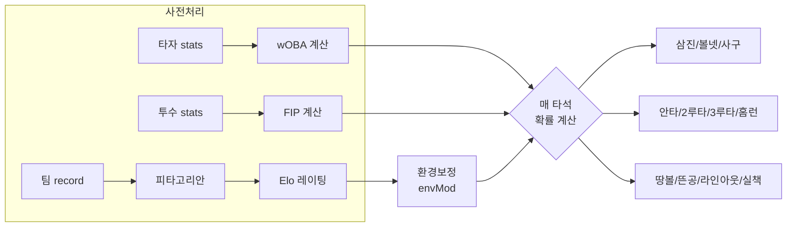
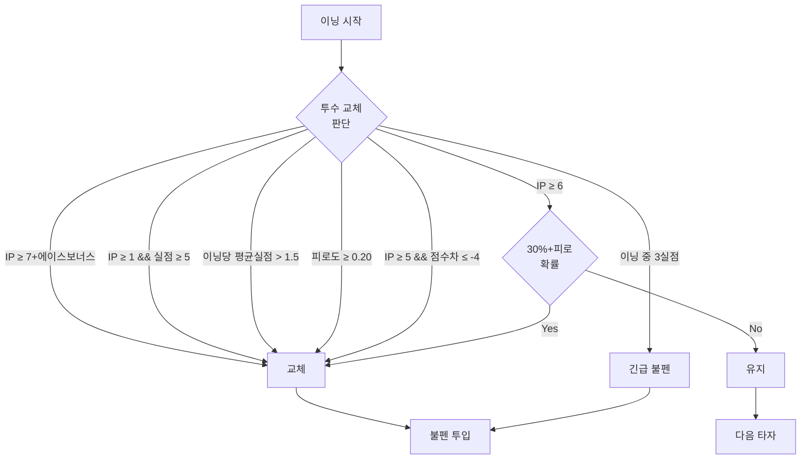
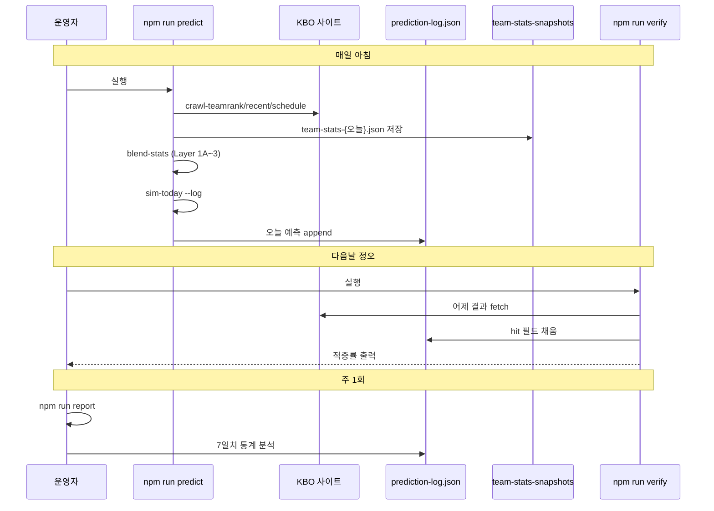
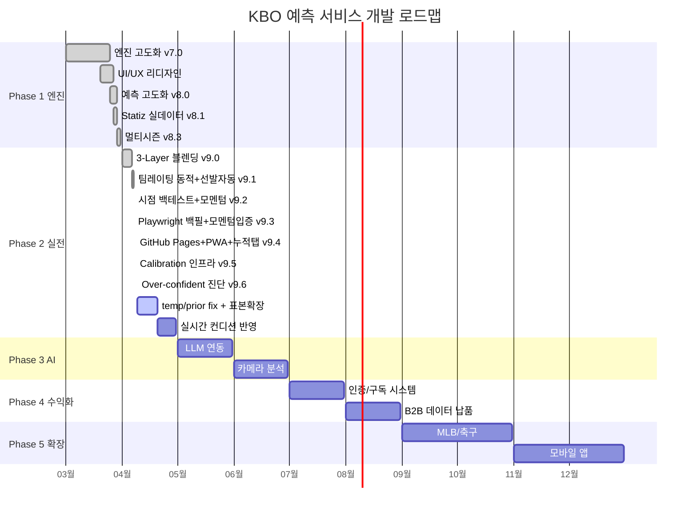

# Scoracle — KBO 경기 예측 AI 서비스 개요서

> **Score + Oracle**. 경기 점수를 예언하는 AI.
> 최종 갱신: 2026-04-10 | 버전: v9.6 | 상태: Calibration fix + 경기 해설/요인 분석 적용. temp 0.7, prior g/15, ★★★ 65%, 룰기반 해설+FactorCard UI
> **프로젝트명 변경** (2026-04-10): baseball-sim → Scoracle (Score + Oracle 합성어, 종목 확장 고려)

---

## 1. 프로젝트 비전

**"AI 동반자형 야구 분석 서비스"** — 사용자가 혼자 판단하지 않고, AI가 옆에서 함께 분석해주는 경험을 제공한다.

### 핵심 가치
- 생성형 AI 기반 스포츠 분석 서비스로 **시장 선점** (유사 서비스 미존재)
- "AI가 인간의 분석을 뛰어넘는다" — 알파고 사례와 같은 **강력한 마케팅 스토리**
- 초기 무료 분석 제공 → 적중률로 신뢰 확보 → 자연스러운 수익화

### 사용자 여정 (Funnel)



---

## 2. 비즈니스 모델

### B2C (소비자 대상)
| 단계 | 내용 |
|------|------|
| 무료 체험 | 기본 승리팀 예측 + AI 대화형 분석 무료 제공 |
| 신뢰 형성 | 적중률 검증 데이터 공개로 서비스 신뢰도 확보 |
| 구독 전환 | 프리미엄 분석 (상세 매치업, 백테스트 등) 구독형 판매 |

### B2B (기업 대상)
| 대상 | 제공 가치 |
|------|-----------|
| KBO 구단 | 시뮬레이션 결과 데이터 납품, 전략 지원 |
| 스포츠 미디어 | 경기 예측 콘텐츠 API 제공 |
| 데이터 분석 업체 | 능력치 산정 레시피(자체 모델) 라이센싱 |

### 확장 계획
- 야구(KBO/MLB) 검증 완료 후 → 축구 등 타 종목으로 확장
- 카메라 기능: 경기 화면 촬영 → 즉시 AI 분석 (바이럴 마케팅 효과)

---

## 3. 기술 아키텍처 (현재)

### 시스템 구성도




### 기술 스택
| 구분 | 기술 |
|------|------|
| 프론트엔드 | React 19 + Vite 8 + Tailwind CSS 3 |
| UI 테마 | 다크 블루/퍼플 글래스모피즘 (deepbetting.io 참고) |
| 시뮬레이션 엔진 | JavaScript (클라이언트 사이드) |
| 통계 방법론 | 몬테카를로 시뮬레이션 (100~10,000회) + 세이버메트릭스 고급 지표 |
| 데이터 소스 | **KBO 공식 사이트 크롤링** (2024~2026 시즌) + Statiz 2025 실데이터 + KBO 공식 일정 API + **최근 10경기 실시간 크롤링** |
| 데이터 크롤링 | Node.js + cheerio (KBO 공식 Record 페이지 ASP.NET PostBack 페이징 처리) |
| 스탯 블렌딩 | **3-Layer 베이지안 블렌딩** (2025 prior × 2026 시즌 × 최근 10경기 오버레이) |
| 경기 일정 | KBO 공식 API 실시간 연동 (Vite 프록시 CORS 우회) |
| 날씨 API | wttr.in (실시간 날씨 연동) |
| AI 분석 | 키워드 파싱 기반 인텔리전스 시스템 |

### 파일 구조
```
scoracle/
  kbo-simulation.jsx     # 전체 앱 (엔진 + UI, ~1800줄)
  crawl-stats.mjs        # KBO 공식 사이트 선수 스탯 크롤러 (~400줄)
  crawl-recent.mjs       # [v9.0] KBO 최근 10경기 데이터 크롤러 (선수별 상세페이지)
  crawl-teamrank.mjs     # [v9.1] KBO 팀 순위/타격/투수 통합 크롤러 (전적+득실점)
  crawl-schedule.mjs     # [v9.1] KBO 일정+예고선발 크롤러 (Schedule.asmx + GameList API)
  blend-stats.mjs        # [v9.0/9.1] 3-Layer 베이지안 블렌딩 + 팀레이팅 동적갱신 + 누락선발 자동등록
  sim-today.mjs          # [v9.0/9.1] 자동 예측 스크립트 (schedule-today.json 동적 로드)
  recent-stats.json      # [v9.0] 최근 10경기 크롤링 캐시 (날짜별 무효화)
  team-stats.json        # [v9.1] 팀 전적/득실점 캐시 (일별 갱신, last10/streak 포함)
  schedule-today.json    # [v9.1] 당일 일정+예고선발 캐시
  team-stats-snapshots/  # [v9.2] 일별 팀 전적 스냅샷 보관소
  prediction-log.json    # [v9.2] 누적 예측·결과 로그 (적중률 추적)
  verify-yesterday.mjs   # [v9.2] 어제 결과 자동 매칭 + log hit 채움
  stats-report.mjs       # [v9.2] 누적 적중률 리포트 (전체/신뢰도/팀별/주별)
  predict-snapshot.mjs   # [v9.2/9.3] 시점기반 백테스트 러너 + --ab momentum 모드
  backfill-snapshots-pw.mjs  # [v9.3] Playwright 헤드리스 백필 (datepicker select 활용)
  compute-historical-rsra.mjs # [v9.3] Schedule API → 일자별 누적 득실점 계산
  src/main.jsx           # 엔트리포인트
  src/index.css          # 글로벌 다크 테마 스타일 (글래스모피즘/네온/애니메이션)
  index.html             # HTML 템플릿
  package.json           # 의존성 관리 + 크롤링 스크립트
  vite.config.js         # 빌드 설정 + KBO API 프록시
  tailwind.config.js     # 커스텀 다크 테마 색상/그라디언트/글로우
  backtest-runner.mjs    # 2025 시즌 백테스트 스크립트 (독립 실행)
  crawled-stats-*.json   # 크롤링 결과 데이터 (JSON)
  Logs/Plans/            # [v9.0] 구현 플랜 기록
  HANDOVER.md            # 인수인계 문서 (운영 런북 / 장애 대응 / 계정 이양)
  archive/               # 현행 파이프라인 미사용 — 이력 보존용
    legacy-python/       #   statiz_crawler.py, generate_docx.py, player_ids.json
    legacy-scripts/      #   sim-yesterday.mjs, backfill-snapshots.mjs, backtest-2024.mjs 등
    unrelated/           #   UE5 유니폼 데모 등 타 주제 산출물
    docs-v8/             #   개요서 v8.0/v8.1 docx (현행은 프로젝트_개요서.md)
    data-snapshots/      #   로컬 데이터 백업 (gitignore, 커밋 안 됨)
```

---

## 4. 시뮬레이션 엔진 상세

### 4.1 데이터 수록 범위

| 구분 | 내용 | 수록량 |
|------|------|--------|
| 팀 | KBO 10개 구단 전체 | 10팀 |
| 타자 | 팀당 9명 (주전 라인업), 시즌별 실데이터 | 90명×3시즌 (WAR 보유 60+명) |
| 투수 | 팀당 선발 3명 + 불펜 스탯, 시즌별 실데이터 | 30명×3시즌 (전원 WAR/FIP 보유) + 불펜 |
| 구장 | 9개 구장 (파크팩터/돔 여부) | 9곳 |
| 날씨 | 6종 (맑음/흐림/비/추위/더위/강풍) | 6종 |
| 시즌 데이터 | 2024/2025/2026 시즌별 선수·팀 스탯 분리 관리 | 3시즌 |
| 백테스트 | 2024 + 2025 시즌 실제 경기 결과 | 120경기 (시즌당 60경기) |

### 4.2 반영 변수 (28개 카테고리)

#### 선수 개인 스탯
| 변수 | 타자 | 투수 |
|------|------|------|
| 기본 스탯 | AVG, OBP, SLG, HR, SPD | ERA, WHIP, K/9, BB/9, IP |
| 고급 스탯 | WAR, defRAA, totalAvg, RBI, **wOBA** | WAR, WPA/LI, **FIP**, 투구엔트로피 |
| 컨디션 | recentForm (최근 폼) | recentForm (최근 폼) |
| 좌우 매치업 | bat (L/R/S) | throws (L/R) |

#### 환경 요소
| 변수 | 설명 | 보정 범위 |
|------|------|-----------|
| 구장 파크팩터 | 사직 1.08 ~ 고척 0.92 | 안타/홈런 확률 |
| 돔구장 여부 | 날씨 영향 80% 감소 | 날씨 보정 축소 |
| 날씨 | 안타/홈런/실책 확률 보정 | hitMod, hrMod, errMod |
| 홈어드밴티지 | 홈팀 +4% 전체 보정 | 타석 확률 |

#### v6.0 보정 (5개)
| 변수 | 설명 | 보정 범위 |
|------|------|-----------|
| 요일별 성적 | 주말 홈팀 유리, 월요일 부진 | 홈 0.97~1.04 / 원정 0.97~1.01 |
| 시간대 성적 | 주간 타고투저, 야간 투고타저 | 안타 0.98~1.04, HR 0.97~1.06 |
| 배당값 보정 | 언더독 부스트 / 탑독 페널티 | 언더독 최대+5%, 탑독 최대-3% |
| 팀 상대전적(H2H) | 시즌별 팀간 승률 (2024/2025) | 승률 .600 → +1.5% |
| 투수-타자 매치업 | 통산 상대 타율 기반 | 최대 +/-8% |

#### v7.0 신규 기능 (3개)
| 변수 | 설명 | 보정 범위 |
|------|------|-----------|
| 투수 피로도 | 이닝/실점/피안타 누적 → 능력 하락 | 삼진-50%, 볼넷+60%, 피안타+80% (최대) |
| 지능형 투수 교체 | 피로도/실점/스코어/에이스 여부 종합 판단 | 7회 일괄 → 상황별 교체 |
| 도루/희생번트 | 속력 기반 도루, 접전 시 하위타선 번트 | SPD 7+ 도루, 7회+ 번트 |

#### v8.0 신규 기능 (10개)
| 기능 | 설명 |
|------|------|
| **wOBA (가중출루율)** | 타자 통합 공격 지표 — AVG/OBP/SLG 개별 반영 대신 단일 지표로 정확도 향상 |
| **FIP (수비무관방어율)** | ERA 대신 투수 본연의 능력만 측정 — 홈런/볼넷/삼진 기반, 수비 노이즈 제거 |
| **피타고리안 기대승률** | RS^1.83 / (RS^1.83 + RA^1.83) — 팀 득실점 기반 실제 전력 측정 (KBO 최적화 지수 1.83) |
| **Elo 동적 레이팅** | 실제 승률(60%) + 피타고리안(40%) 가중 블렌딩 → 팀 전력 동적 보정 (±6%) |
| **평균 회귀 보정** | PA/IP 표본 크기 기반 소표본 보정 — 리그 평균으로 자동 회귀 (과적합 방지) |
| **리그 평균 상수** | KBO 2025 리그 평균값 (AVG .265, ERA 3.80 등) 기준점으로 활용 |
| KBO 공식 일정 연동 | koreabaseball.com API → 실제 날짜별 경기 일정 실시간 반영 |
| 과거 경기 결과 표시 | 과거 날짜 선택 시 실제 스코어 + 승패 뱃지 표시 |
| 오늘의 경기 인라인 시뮬 | 경기 카드 클릭 → 확장 레이어에서 바로 채팅 + 시뮬레이션 |
| 다크 블루/퍼플 UI | 글래스모피즘 + 네온 글로우 + 그라디언트 기반 전문 서비스 UI |
| **Statiz 2025 실데이터** | 전 구단 선수 스탯을 Statiz/FancyStats 기반 실측치로 교체 (WAR/FIP 전원 반영) |
| **로스터 최신화** | MLB 이적(이정후/김혜성), 트레이드(손아섭), 부상(안우진), 은퇴(추신수) 등 7건 반영 |
| **KBO 공식 구단 로고** | NaverCDN 실제 엠블럼 이미지 적용 (이모지 → 공식 로고) |
| **외부 접속 지원** | Cloudflared 터널링으로 모바일 외부 테스트 환경 구축 |

#### v9.3 신규 기능 — Playwright 백필 + 모멘텀 효과 입증 (8개)
| 기능 | 설명 |
|------|------|
| **`backfill-snapshots-pw.mjs`** | Playwright 헤드리스 chromium으로 KBO TeamRankDaily 페이지 자동화. HTTP 직접 호출(v9.2)이 봇 차단된 문제를 우회 |
| **datepicker select 드롭다운 조작** | jQuery UI datepicker의 month/year `<select>` 직접 조작 (0-based month) → 임의 과거 날짜로 즉시 이동 |
| **`compute-historical-rsra.mjs`** | Schedule.asmx에서 시즌 모든 경기 결과 fetch → 일자별 팀별 누적 rs/ra 계산 → 스냅샷 보강 |
| **`blend-stats --no-momentum`** | Layer 2C 모멘텀 끄기 옵션 (A/B 비교용) |
| **`sim-today --version`** | prediction-log.json에 임의 버전 태그로 기록 (v9.1-no-mom, v9.2-mom 등 구분) |
| **`predict-snapshot --ab momentum`** | 한 번 실행으로 같은 날짜에 두 버전(모멘텀 ON/OFF) 모두 예측 |
| **`stats-report --compare`** | 같은 (date, away, home) 키로 매칭하여 버전별 적중 비교 + 순효과 산출 |
| **시점 백테스트 모멘텀 +8.0%p 입증** | 4/1~4/5 50개 시점 예측에서 v9.1-no-mom 60% vs v9.2-mom 68%, 차이 4건 모두 분석 가능 |

#### v9.2 신규 기능 — 시점기반 검증 + 모멘텀 (10개)
| 기능 | 설명 |
|------|------|
| **일별 스냅샷 시스템** | `crawl-teamrank.mjs`가 매 실행 시 `team-stats-snapshots/team-stats-{YYYYMMDD}.json` 보관 → 시점 정확 백테스트 가능 |
| **last10/streak 수집** | KBO 팀 순위 페이지의 "최근 10경기"·"연속" 컬럼 파싱 (예: "7승0무1패", "4승") |
| **Layer 2C 모멘텀 보정** | last10 승률 ±5점 + streak ≥3 ±2점 → teamRating에 흡수 (예: SSG 4연승 → +6, 롯데 6연패 → -4) |
| **`blend-stats --snapshot`** | CLI 옵션으로 특정 날짜 스냅샷 강제 사용, 백테스트 시 D-1 시점 데이터로 예측 |
| **`blend-stats --no-recent`** | 최근 10경기 오버레이 스킵 (시점 검증/A-B 테스트용) |
| **`sim-today --log`** | 예측 결과를 `prediction-log.json`에 자동 append, 같은 날 재실행 시 교체 |
| **`prediction-log.json` 스키마** | `{predictions: [{date, version, games:[{predWinner, confidence, actualHome, hit}]}]}` |
| **`verify-yesterday.mjs`** | KBO Schedule.asmx에서 어제 실제 스코어 fetch → 팀명 부분 매칭 → hit 자동 채움 + 누적 적중률 출력 |
| **`stats-report.mjs`** | 누적 통계: 전체 적중률 / 신뢰도별(★~★★★) / 팀별(홈·원정 합산) / 주별 / 일자별 |
| **`predict-snapshot.mjs`** | 날짜 범위 입력 → 각 일자에 D-1 스냅샷 강제 로드 → blend → schedule → sim 일괄 실행 |

#### v9.1 신규 기능 — 완전 자동화 파이프라인 (8개)
| 기능 | 설명 |
|------|------|
| **crawl-teamrank.mjs** | KBO 팀 순위(승/패/무) + 팀 타격(득점) + 팀 투수(실점) 통합 크롤링 → `team-stats.json` |
| **crawl-schedule.mjs** | Schedule.asmx + Main.asmx/GetKboGameList 활용해 당일 경기 일정 + 양팀 예고선발 크롤링 → `schedule-today.json` |
| **Layer 1B: 팀 레이팅 동적 블렌딩** | `LEGACY_TEAM_RATINGS_2025` prior × 2026 시즌 전적, `w=min(1.0, games/30)` 베이지안 회귀, idempotent |
| **Layer 1C: 누락 선발 자동 등록** | schedule의 선발이 KBO_TEAMS에 없으면 recent10 실측 우선, bullpen 평균 폴백으로 자동 추가 |
| **sim-today.mjs 완전 자동화** | 하드코딩 제거, `schedule-today.json` 동적 로드, 요일 자동 계산, 백테스트용 인자 모드 지원 |
| **`npm run predict` 통합 파이프라인** | crawl-teamrank → crawl-schedule → crawl-recent → blend-stats → sim-today 일괄 실행 |
| **rating 공식** | `50 + (pct-0.5)×80 + runDiff/G × 3`, 클램프 [40, 100] |
| **선발 매칭률 개선** | 4/2 추정치 25% → v9.1 정규선발 100% (예고선발 자동 감지) |

#### v9.0 신규 기능 — 실전 예측 시스템 (14개)
| 기능 | 설명 |
|------|------|
| **3-Layer 블렌딩 엔진** | Layer1: 베이지안(2025 prior × 2026 시즌), Layer2: 최근 10경기 오버레이(max 30%), Layer3: 동적 recentForm(±8%) |
| **calcFIP 버그 수정** | 기존 `*9` 오류로 FIP가 6.5(상한)에 고정 → 투수 구분 불가. 수정 후 투수력 정상 반영 |
| **pF(투수팩터) 리센터링** | `(4.5-fip)/4.5+.5` (평균=0.65) → `1+(3.80-fip)*0.12` (평균=1.0) — 리그 평균 투수가 중립 보정 |
| **볼넷 계수 수정** | 계수 0.7→0.23, 볼넷률 25.7%→~8.4% (실제 KBO 수준) |
| **멀티플라이어 스태킹 억제** | recentForm ±8% 클램프, WAR 보너스 max 3%, 투수WAR max 4%, 홈 어드밴티지 4%→2.5% |
| **Elo 임팩트 반감** | Elo 보정 계수 0.0004→0.0002 (2025 팀 레이팅 과대평가 방지) |
| **crawl-recent.mjs** | KBO 선수 상세페이지에서 "최근 10경기" 테이블 크롤링 — 타자 AVG/OBP/SLG/HR, 투수 ERA/WHIP/K9/BB9 |
| **blend-stats.mjs** | 베이지안 회귀(REG_PA=120, REG_IP=40) + 최근10경기 가중 블렌딩 + recentForm 자동 산출 → jsx 자동 반영 |
| **recent-stats.json** | 크롤링 캐시 — crawlDate 기반 일별 무효화, 타자/투수별 최근 10경기 합산 스탯 저장 |
| **sim-today.mjs** | 당일 경기 예측 스크립트 — jsx에서 KBO_TEAMS 추출, 선발투수 매칭, MC 1000회, 신뢰도(★~★★★) 표시 |
| **sim-yesterday.mjs** | 2026 시즌 백테스트 러너 — 15경기(3/28~3/31) 엔진 동기화 검증 |
| **선발투수 동적 등록** | 당일 선발 미등록 시 수동 추가 시스템 구축 — 4/1~4/5 총 19명 신규 등록 |
| **2026 실전 예측 검증** | 4/1(5/5=100%), 4/2(1/5=20%), 4/5(3/5=60%) — 누적 9/15=60% |
| **/플랜 스킬** | 구현 계획 수립 자동화 — Logs/Plans 폴더에 md 파일로 플랜 생성·기록 |

#### v8.2 신규 기능 (3개)
| 기능 | 설명 |
|------|------|
| **2026 시범경기 반영** | 2026 시즌 시범경기 데이터 수록 (선수 스탯, 팀 레이팅) |
| **외국인선수 교체** | 2026 시즌 신규 외국인선수 로스터 반영 |
| **아시아쿼터 적용** | 2026 시즌 아시아쿼터 제도 변경사항 반영 |

#### v8.3 신규 기능 (5개)
| 기능 | 설명 |
|------|------|
| **멀티시즌 데이터** | 2024/2025/2026 시즌별 선수·팀·H2H 데이터 자동 분리 적용 |
| **시즌 자동 감지** | 경기 날짜 기반 시즌 연도 자동 판별 (getSeasonYear/getSeasonTeam) |
| **레거시 데이터 보존** | LEGACY_STARTERS_2024/2025, TEAM_RATINGS_2024/2025, TEAM_BULLPEN_2024/2025 별도 관리 |
| **멀티시즌 백테스트** | 2024/2025 시즌 선택형 백테스트 (시즌별 데이터 자동 적용) |
| **스탯 크롤링 자동화** | KBO 공식 사이트 크롤러 (crawl-stats.mjs) — 타자 6종 + 투수 6종 스탯 자동 수집 |

### 4.3 확률 계산 흐름

#### v9.2 데이터 파이프라인 (`npm run predict` → 자동 누적 → 다음날 verify)



#### 매 타석 확률 계산 흐름



```
타자력 = wOBA / .340 × 홈(1.025) × 날씨 × recentForm(±8%) × 좌우 × WAR(max3%) × 환경 × 피로
투수력 = (1 + (3.80-FIP)×0.12) × recentForm(±8%) × WPA(max4%) × 시간대보정
환경보정(envMod) = 요일 × 배당 × H2H × 매치업 × Elo(±3%)
볼넷률 = pB × (OBP/.34) × 0.23 × 좌우  (v9.0 계수 수정: 0.7→0.23)
```

### 4.4 투수 교체 의사결정 (v7.0)



### 4.5 게임 진행 로직
- 정규 9이닝 + 연장 최대 12이닝
- **v7.0** 지능형 투수 교체 (피로도/실점/스코어 종합 판단)
- **v7.0** 이닝별 투수 피로도 반영 (삼진↓, 볼넷↑, 피안타↑)
- **v7.0** 도루 시도 (SPD 7+ 주자, 접전 시 확률 증가)
- **v7.0** 희생번트 (7회+ 하위타선, 접전 시 주자 진루)
- 끝내기 처리 (9회 이후 홈팀 리드 시)
- 주루 판단 (속력 기반 진루/득점 확률)
- 병살, 희생플라이 확률 적용
- 이닝 중 3실점 이상 시 긴급 투수 교체

---

## 5. UI/UX 구성 (3개 탭)

### 5.1 오늘의 경기 (TodayTab)
- 날짜 선택 → **KBO 공식 API에서 실제 경기 일정 로드** (Vite 프록시 CORS 우회)
- 월별 캐시로 같은 달 재요청 방지
- "KBO 공식 일정" / "자동 생성 일정" 데이터 소스 뱃지 표시
- **과거 경기**: 실제 스코어 표시 (이긴 팀 시안색 강조 + 승패 뱃지)
- **예정 경기**: "VS" 표시
- **AI 예측 해설** (v9.6): prediction-log.json fetch → 경기별 해설 자동 표시
  - 접힌 상태: 🔮 한 줄 해설 + 예측 결과(팀명 ★ %) 인라인 표시
  - 펼친 상태: FactorCard (해설 배너 + 기여도 바 + 투수 비교 + 구장/H2H)
  - 룰 기반 템플릿 — LLM 없이 `Sim.getFactors()` + `generateNarrative()`
  - 핵심 요인 자동 순위: 선발투수 > 최근 폼 > 팀 전력 > 상대전적 > 구장 (impact 기반)
  - 불리 요인도 표시: "다만 ○○의 시즌 성적이 앞섬" 등
  - 하위 호환: factors 없는 기존 데이터는 해설 미표시
- **인라인 시뮬레이션**: 경기 카드 클릭 → 아래로 확장
  - AI 채팅 (BALL-E): 선수 컨디션 자연어 입력 → 수치 변환
  - 구장 정보 + 상대전적(H2H) 패널
  - 단일 경기 / 몬테카를로 시뮬레이션 (100~10,000회)
  - 승률 바, 득점 분포, 스코어보드, 이닝별 로그
- **KBO 공식 구단 로고** (NaverCDN 연동, 10개 구단 실제 엠블럼)
- 실시간 날씨 API 연동 (wttr.in)
- 경기 없는 날: "해당 날짜에 예정된 경기가 없습니다" 안내
- API 실패 시 자동 폴백 (랜덤 대진표)

### 5.2 가상 대결 (VirtualTab)
- 홈/원정팀 자유 선택 (10팀)
- 선발투수 선택 (팀당 3명)
- 요일/시간대/날씨 수동 설정
- **AI 인텔리전스 채팅**: 자연어로 선수 컨디션 입력 → 수치 자동 변환
  - 예: "기아 양현종 어제 술 마셨대 10% 하락"
- 단일 경기 시뮬레이션 + 몬테카를로 (100~10,000회)
- 승률 비교, 득점 분포, 이닝별 상세 로그

### 5.3 백테스트 (BacktestTab)
- **시즌 선택**: 2024/2025 시즌 전환 (시즌별 데이터 자동 적용)
- 시즌당 60건 실제 경기 vs 시뮬레이션 예측 비교 (총 120경기)
- 전체 적중률 산출
- 경기별 예측 승률, 예측 스코어, 실제 결과, 적중 여부 테이블

### 5.4 UI/디자인 (v8.0)
- 다크 블루/퍼플 테마 (deepbetting.io 참고)
- 글래스모피즘 카드 (backdrop-filter blur + 반투명 그라디언트)
- 네온 글로우 효과 (텍스트/보더 퍼플/블루 글로우)
- 그라디언트 버튼 (블루→퍼플 + hover 애니메이션)
- 커스텀 스크롤바/테이블/인풋 (다크 테마 일관성)
- 배경 그리드 패턴 + fadeIn/pulse-glow 애니메이션
- 반응형 레이아웃 (모바일/데스크톱)

---

### 5.5 일일 운영 흐름 (v9.2)



---

## 6. 마케팅 전략 (미팅 합의)

| 전략 | 내용 |
|------|------|
| 핵심 메시지 | "AI가 인간의 분석을 뛰어넘는다" |
| 신뢰 확보 | 초기 무료 분석 → 적중률 공개 → 자연스러운 결제 유도 |
| 차별화 | AI 캐릭터(BALL-E)와 대화하며 분석하는 동반자형 경험 |
| 바이럴 | 카메라 촬영 → 즉시 분석 기능 (향후 구현) |
| 벤치마킹 | deepbetting.io (디자인 참고), 메이저리그 스몰볼 성공사례 |

---

## 7. 현재 구현 상태 vs 최종 목표

| 기능 | 현재 상태 | 최종 목표 |
|------|-----------|-----------|
| 시뮬레이션 엔진 | **v9.6 3-Layer 블렌딩 + Layer 2C 모멘텀 + temp 0.7/threshold 65/prior g/15 + factor 수집 + 해설 생성** + 28개 변수 + 세이버메트릭스 + 피로도/교체AI | 서버사이드 + 실시간 데이터 |
| 데이터 | **3-Layer + 팀 레이팅 동적 + 모멘텀 + Playwright 백필 + 일일 자동 누적** | 완전 자동 파이프라인 ✅ |
| 예측 파이프라인 | **GitHub Actions daily-predict.yml (09/17시 KST 자동)** + `npm run predict` + Playwright 백필 + A/B | - |
| 배포 | **GitHub Pages + PWA(manifest/OG/아이콘)** ✅ | 커스텀 도메인 |
| 실전 예측 | **누적 42경기 v9.2-mom 61.9%** / 시점 백테스트 68% (17/25) — **calibration 역전 진단 완료 (v9.6)** | 적중률 70%+, calibration 정상화 |
| 경기 일정 | **KBO 공식 API 실시간 연동 + GitHub Pages 정적 fetch (완료)** | - |
| 선수 데이터 | **최근 10경기 + 팀 전적 + 예고선발 자동 크롤링 (완료)** | 스케줄 기반 자동 갱신 |
| 과거 결과 | **실제 스코어 + verify-yesterday 자동 검증 (완료)** | 경기별 상세 기록 연동 |
| 검증 인프라 | **Brier/Log loss/RMSE/Calibration plot/Reliability + ★ 등급별 inspect dump** ✅ (v9.5/v9.6) | bootstrap 신뢰구간 |
| AI 분석 | **룰기반 해설 + FactorCard UI** (v9.6) — `Sim.getFactors()` + `generateNarrative()` | 생성형 AI (LLM) 연동으로 품질 업그레이드 |
| 투수 교체 | **v7.0 상황별 지능형 교체 완료** | 더 정교한 전략 (중계/마무리 분리) |
| UI/디자인 | **v8.0 다크 블루/퍼플 글래스모피즘 + PredictionLogTab + FactorCard(기여도 바/투수 비교)** | 인터랙티브 차트/3D 시각화 |
| 백테스트 | **120경기 (2024+2025) + 2026 실전 누적 42경기 + 시점 50경기** | 전체 시즌 (720경기+) |
| 사용자 인증 | 없음 | 로그인/구독 시스템 |
| 결제 | 없음 | 구독형 결제 연동 |
| 종목 | KBO 야구만 | MLB + 축구 등 확장 |
| 카메라 분석 | 미구현 | 화면 촬영 → 즉시 분석 |
| 모바일 앱 | 웹 전용 | 네이티브 앱 (iOS/Android) |

---

## 8. 향후 개발 로드맵

### 로드맵 타임라인




### Phase 1 — 엔진 고도화 (완료 ✅)
- [x] 요일별/시간대별 성적 보정
- [x] 배당값(언더독/탑독) 보정
- [x] 선발투수-타자 상대전적 매치업
- [x] 팀 상대전적(H2H) 반영
- [x] 백테스트 탭 (2025 시즌 60경기)
- [x] 투수 교체 전략 지능화 (v7.0)
- [x] 도루/희생번트 전략 (v7.0)
- [x] 이닝별 투수 피로도 반영 (v7.0)

### Phase 1.5 — UI/UX + 데이터 연동 (완료 ✅)
- [x] 다크 블루/퍼플 UI 리디자인 (글래스모피즘/네온 글로우)
- [x] KBO 공식 일정 API 연동 (실제 날짜별 경기 일정)
- [x] 과거 경기 실제 결과(스코어) 표시
- [x] 오늘의 경기 인라인 시뮬레이션 (경기 클릭 → 확장 레이어)
- [x] 오늘의 경기 탭에 AI 채팅 + 시뮬레이션 옵션 통합
- [x] 2024/2025 시즌 독립 백테스트 스크립트 작성
- [x] 백테스트 검증: 2024 73.3%, 2025 71.7% (고신뢰 ~78%)
- [x] Tailwind 커스텀 테마 (다크 색상/그라디언트/글로우/섀도우)
- [x] Vite 프록시 설정 (KBO API CORS 우회)

### Phase 1.7 — 예측 고도화 (완료 ✅)
- [x] wOBA (가중출루율) 도입 — 타자 통합 공격 지표로 예측력 강화
- [x] FIP (수비무관방어율) 도입 — ERA 대체, 투수 본연 능력 측정
- [x] 피타고리안 기대승률 — 팀 득실점 기반 전력 지표 (지수 1.83 KBO 최적화)
- [x] Elo 동적 레이팅 — 승률 + 피타고리안 가중 블렌딩, 팀 전력 동적 보정
- [x] 평균 회귀 보정 — PA/IP 표본 크기 기반 소표본 과적합 방지
- [x] 리그 평균 상수 — KBO 2025 기준값 설정 (AVG .265, ERA 3.80 등)
- [x] 백테스트 재검증: **v7.0 71.7% → v8.0 76.7% (+5.0%p 향상)**
- [x] 고신뢰(60%+) 적중률: **80.4%** (51경기 중 41경기 적중)

### Phase 1.8 — Statiz 실데이터 + 비주얼 고도화 (완료 ✅)
- [x] **Statiz 2025 시즌 실데이터 반영** — 전 구단 90명 타자 + 30명 투수 실측 스탯
- [x] 투수 WAR/FIP 전원 반영 (기존 5/30 → 30/30)
- [x] 타자 WAR 60+명 반영 (기존 ~20% → ~70%)
- [x] 로스터 최신화 7건: MLB 이적(이정후→SF, 김혜성→LAD), 트레이드(손아섭 NC→한화), 부상(안우진), 은퇴(추신수), 외국인 교체(벤자민/윌커슨/루친스키 등)
- [x] 투구손 교정: 임찬규/김광현/김윤식 → 좌투(L)
- [x] KBO 공식 구단 로고 적용 (NaverCDN 엠블럼, 이모지 제거)
- [x] TeamLogo 컴포넌트 (6개 렌더링 위치, 반응형 사이즈)
- [x] Cloudflared 터널링 외부 접속 환경 구축
- [x] 백테스트 러너 데이터 동기화 + 재검증
- [x] 백테스트 결과: **v8.1 75.0% (45/60)**, 고신뢰 78.4% (40/51)
  - 실데이터 반영으로 이전 대비 -1.7%p (과적합 제거로 정상 변동)

### Phase 1.9 — 멀티시즌 + 스탯 크롤링 자동화 (완료 ✅)
- [x] **v8.2**: 2026 시범경기 데이터 반영, 외국인선수 교체, 아시아쿼터 적용
- [x] **v8.3**: 시즌별 데이터 자동 적용 시스템 (2024~2026)
  - getSeasonYear() / getSeasonTeam() / getSeasonH2H() / getSeasonResults()
  - LEGACY_STARTERS_2024/2025, TEAM_RATINGS_2024/2025, TEAM_BULLPEN_2024/2025
  - H2H_RECORDS_2024 (10×10 팀간 상대전적 매트릭스)
- [x] **v8.3**: 멀티시즌 백테스트 (2024/2025 시즌 선택형)
- [x] **v8.3**: KBO 공식 사이트 선수 스탯 크롤러 (crawl-stats.mjs)
  - 타자: AVG, HR, RBI, OBP, SLG, OPS, SB, CS (6개 페이지 크롤링)
  - 투수: ERA, WHIP, SO, BB, IP, QS, CG, GS (6개 페이지 크롤링)
  - ASP.NET PostBack 페이징 처리 (쿠키 + __VIEWSTATE)
  - `--apply` 모드: kbo-simulation.jsx 자동 업데이트
  - npm scripts: crawl / crawl:2025 / crawl:2026 / crawl:apply

### Phase 2.0 — 실전 예측 시스템 (완료 ✅)
- [x] **v9.0**: 엔진 버그 수정 (calcFIP ×9, pF 센터링, BB 계수, 멀티플라이어 스태킹)
- [x] **v9.0**: 3-Layer 블렌딩 엔진 구축
  - Layer 1: 베이지안 회귀 (2025 prior × 2026 시즌 데이터)
  - Layer 2: 최근 10경기 오버레이 (max weight 30%, games/10 비례)
  - Layer 3: 동적 recentForm (OPS비율/ERA역비율, ±8% 클램프)
- [x] **v9.0**: crawl-recent.mjs — KBO 선수 상세페이지 최근 10경기 크롤러
- [x] **v9.0**: blend-stats.mjs — 베이지안 블렌딩 + 최근10경기 오버레이 → jsx 자동 반영
- [x] **v9.0**: sim-today.mjs — 당일 경기 예측 (MC 1000회, 신뢰도 ★~★★★)
- [x] **v9.0**: 선발투수 동적 등록 — 4/1~4/5 총 19명 신규 등록
- [x] **v9.0**: 2026 실전 예측 검증 — 누적 9/15 = 60%, 고신뢰(★★★) 75%
- [x] **v9.0**: /플랜 스킬 등록 — 구현 계획 자동 생성 시스템

### Phase 2.6 — Calibration 진단 (완료 ✅, v9.5/v9.6)
- [x] **v9.4**: GitHub Pages 배포 (deploy-pages.yml) + schedule-today.json 정적 fetch
- [x] **v9.4**: PWA — manifest.json + OG 메타 + 야구공 아이콘 (모바일 홈스크린)
- [x] **v9.4**: PredictionLogTab 신설 — 누적 적중률 + Calibration 차트
- [x] **v9.4**: GitHub Actions daily-predict.yml — 매일 09/17시 KST verify+predict
- [x] **v9.5**: stats-report `--calibration` — 빈별 적중률 + Brier + Log loss + RMSE
- [x] **v9.5**: sim-today `--temp <0~1>` 압축, `--threshold "55,60"` boundary 외부화
- [x] **v9.5**: predict-snapshot `--ab calibration` — temp A/B 비교
- [x] **v9.5 anomaly 발견**: 42경기 누적에서 ★★★ 33% / ★ 82% calibration 완전 역전
- [x] **v9.5 결정**: temp 압축 도입 보류 — 25경기 A/B에서 Brier 개선되나 Top-1 56→52% 하락 (표본 부족)
- [x] **v9.6 진단**: stats-report `--inspect <stars>` — ★ 등급별 케이스 dump 도구
- [x] **v9.6 진단**: ★★★ 12경기 + ★ 14경기 case-by-case 분석 (`Logs/Analysis/20260409_*.md`)
- [x] **v9.6 진단**: 원인 분류 = (B) oddsMod×eloMod×recentForm×parkFactor 복합 곱셈 over-confidence + (A) 시즌초 prior 지배 (w=g/30)
- [x] **v9.6 진단**: 65~75% 구간 0/4 가장 파괴적, 75%+ 2/3 정상 — 엔진 버그(C) 아님
- [x] **v9.6 fix** (2026-04-10): temp 0.7 + prior g/15 + ★★★ threshold 65% 적용
- [x] **v9.6 해설** (2026-04-10): `Sim.getFactors()` — SP/momentum/rating/H2H/park 5개 factor 정량 수집
- [x] **v9.6 해설**: `generateNarrative()` — 룰 기반 한 줄 해설 (pros/cons/confidence 조합)
- [x] **v9.6 해설**: prediction-log.json에 `factors` 필드 추가 (하위 호환, optional)
- [x] **v9.6 해설**: FactorCard UI — 해설 배너 + 기여도 바 + 투수 비교 + 구장/H2H 카드
- [x] **v9.6 해설**: TodayTab predMap fetch — prediction-log.json에서 당일 factors 자동 로드
- [ ] **v9.6 모니터링**: 표본 50+ 시점 재분석 (4/16 기준 ★★★≥50%, RMSE<20% 목표)

### Phase 2.3 — Playwright 백필 + 모멘텀 입증 (완료 ✅, v9.3)
- [x] **v9.3**: Playwright 환경 검증 (chromium 헤드리스)
- [x] **v9.3**: backfill-snapshots-pw.mjs — KBO datepicker select 드롭다운 활용
- [x] **v9.3**: 4/1~4/5 + 3/31 6일치 과거 스냅샷 백필 (last10/streak 포함)
- [x] **v9.3**: compute-historical-rsra.mjs — Schedule API 누적 득실점 계산
- [x] **v9.3**: blend-stats `--no-momentum` 옵션
- [x] **v9.3**: sim-today `--version` 태그 옵션
- [x] **v9.3**: predict-snapshot `--ab momentum` 모드
- [x] **v9.3**: stats-report `--compare` 모드
- [x] **v9.3**: 시점 백테스트 50개 예측 실행 (v9.1-no-mom vs v9.2-mom)
- [x] **v9.3**: 모멘텀 효과 +8.0%p 입증 (60% → 68%)

### Phase 2.2 — 시점기반 검증 시스템 (완료 ✅, v9.2)
- [x] **v9.2**: 일별 스냅샷 시스템 (`team-stats-snapshots/`)
- [x] **v9.2**: KBO 팀 순위 last10/streak 컬럼 파싱
- [x] **v9.2**: Layer 2C 모멘텀 보정 — last10 ±5, streak ≥3 ±2
- [x] **v9.2**: blend-stats `--snapshot YYYYMMDD` + `--no-recent` CLI
- [x] **v9.2**: sim-today `--log` `--quiet` 옵션, prediction-log.json append
- [x] **v9.2**: verify-yesterday.mjs — KBO 결과 자동 매칭
- [x] **v9.2**: stats-report.mjs — 누적/신뢰도/팀별/주별/일자별 리포트
- [x] **v9.2**: predict-snapshot.mjs — D-1 스냅샷 시점 백테스트 러너
- [x] **v9.2**: npm scripts 추가 (`verify`, `report`, `backtest:snapshot`)
- [x] **v9.2**: 4/5 데이터로 검증 — v9.0 60% → v9.2 80% (LG@키움 모멘텀 효과)
- [ ] **v9.2 미해결**: KBO TeamRankDaily 봇 차단 → 과거 스냅샷 역추출 보류 (Playwright 필요)

### Phase 2.1 — 완전 자동화 파이프라인 (완료 ✅, v9.1)
- [x] **v9.1**: crawl-teamrank.mjs — 팀 전적/득실점 크롤러
- [x] **v9.1**: crawl-schedule.mjs — 당일 일정 + 양팀 예고선발 크롤러
- [x] **v9.1**: blend-stats.mjs Layer 1B — 팀 레이팅 동적 블렌딩 (LEGACY 2025 × 2026)
- [x] **v9.1**: blend-stats.mjs Layer 1C — 누락 선발 자동 등록 (recent10/bullpen 폴백)
- [x] **v9.1**: sim-today.mjs 자동화 — 하드코딩 제거, 인자 모드(백테스트) 지원
- [x] **v9.1**: `npm run predict` 통합 파이프라인 — 5단계 일괄 실행
- [x] **v9.1**: idempotent 보장 — 매 실행 동일 결과, regex 충돌 방지
- [x] **v9.1**: 4/1~4/5 리플레이 백테스트 (look-ahead 영향 분석)

### Phase 2.5 — 데이터 자동화
- [x] KBO 공식 경기 일정 API 자동화 (완료)
- [x] **선수 스탯 크롤링 자동화 (완료 — KBO 공식 사이트)**
- [x] **최근 10경기 실시간 크롤링 (완료 — crawl-recent.mjs)**
- [x] **팀 레이팅 동적 업데이트 (완료 — v9.1)**
- [x] **선발투수 자동 감지 (완료 — v9.1)**
- [x] **시점기반 스냅샷 백테스트 (완료 — v9.2)**
- [x] **모멘텀/연승연패 보정 (완료 — v9.2 Layer 2C)**
- [x] **KBO 과거 스냅샷 역추출 (완료 — v9.3 Playwright)**
- [x] **모멘텀 A/B 검증 (완료 — v9.3 +8.0%p)**
- [ ] **모멘텀 가중치 튜닝** (v9.4) — 현재 ±7점이 최적인지 검증
- [ ] **표본 확장** (v9.4) — 50경기 → 100~200경기로 통계적 신뢰도 강화
- [ ] 백테스트 전체 시즌 확장 (720경기+)
- [ ] 서버사이드 시뮬레이션 이전

### Phase 3 — AI 고도화
- [ ] 생성형 AI(LLM) 연동 → 자연어 대화형 분석
- [ ] AI 캐릭터(BALL-E) 페르소나 강화
- [ ] 카메라 촬영 → 경기 화면 즉시 분석

### Phase 4 — 수익화
- [ ] 사용자 인증 + 구독 시스템
- [ ] B2C 프리미엄 분석 상품 설계
- [ ] B2B 구단/미디어 대상 데이터 납품 체계

### Phase 5 — 확장
- [ ] MLB 데이터 추가
- [ ] 타 종목(축구 등) 확장
- [ ] 모바일 네이티브 앱

---

## 9. 백테스트 검증 결과

### 버전별 적중률 추이

```mermaid
graph LR
    V70[v7.0<br/>71.7%] --> V80[v8.0<br/>76.7%]
    V80 --> V81[v8.1<br/>75.0%]
    V81 --> V83[v8.3<br/>75.0%<br/>+2024 73.3%]
    V83 --> V90[v9.0<br/>실전 60%]
    V90 --> V91[v9.1<br/>완전 자동화]
    V91 --> V92[v9.2<br/>스냅샷+모멘텀<br/>인프라]
    V92 --> V93["✅ v9.3<br/>Playwright 백필<br/>시점검증 60→68%<br/>모멘텀 +8%p 입증"]
    V93 --> V94["✅ v9.4<br/>GitHub Pages 배포<br/>PWA + 누적 적중률 탭<br/>일일 자동 파이프라인"]
    V94 --> V95["✅ v9.5<br/>Calibration 인프라<br/>Brier/RMSE/temp 압축<br/>anomaly 발견"]
    V95 --> V96["✅ v9.6 진단<br/>★★★ 33% / ★ 82% 역전<br/>원인=복합 곱셈 over-confidence<br/>+ 시즌초 prior 지배"]
    V96 -.작업 예정.-> V96B[v9.6 fix<br/>temp 0.7 + prior g/15<br/>+ ★★★ threshold 65%]

    style V90 fill:#4a5568,color:#fff
    style V91 fill:#2d5a8f,color:#fff
    style V92 fill:#1a3a6f,color:#fff
    style V93 fill:#0a5a0a,color:#fff
    style V94 fill:#0a5a0a,color:#fff
    style V95 fill:#7a4a0a,color:#fff
    style V96 fill:#7f1d1d,color:#fff
    style V96B fill:#0a1a4f,color:#fff,stroke-dasharray: 5 5
```




### 9.1 버전별 적중률 비교

| 버전 | 2025 전체 | 2025 고신뢰(60%+) | 2024 전체 | 2026 실전 | 주요 개선 |
|------|-----------|-------------------|-----------|-----------|-----------|
| v7.0 | 71.7% (43/60) | ~78% | - | - | 투수 피로도, 지능형 교체, 도루/번트 |
| v8.0 | 76.7% (46/60) | 80.4% (41/51) | - | - | wOBA, FIP, 피타고리안, Elo, 평균 회귀 |
| v8.1 | 75.0% (45/60) | 78.4% (40/51) | - | - | Statiz 실데이터, 로스터 최신화 |
| v8.3 | 75.0% (45/60) | 78.4% (40/51) | 73.3% (44/60) | - | 멀티시즌, 크롤링 자동화 |
| v9.0 | 75.0% (45/60) | 78.4% (40/51) | 73.3% (44/60) | 60% (9/15) | 3-Layer 블렌딩, 엔진 버그 수정, 실전 예측 |
| v9.1 | 75.0% (45/60) | 78.4% (40/51) | 73.3% (44/60) | 자동화 완료 | 팀 레이팅 동적, 선발 자동감지, `npm run predict` |
| v9.2 | 75.0% (45/60) | 78.4% (40/51) | 73.3% (44/60) | 4/5 80% (4/5) | Layer 2C 모멘텀, 일별 스냅샷, verify/report 자동화 |
| **v9.3** | **75.0% (45/60)** | **78.4% (40/51)** | **73.3% (44/60)** | **시점 68% (17/25)** | Playwright 백필, A/B 검증, 모멘텀 +8.0%p 입증 |
| v9.4 | - | - | - | 누적 자동화 | GitHub Pages 배포, PWA, 누적 적중률 탭, daily-predict.yml |
| v9.5 | - | - | - | 42경기 61.9% | Calibration 인프라(Brier/RMSE/temp), **anomaly 발견** ★★★ 33% / ★ 82% |
| **v9.6** (진단) | - | - | - | 진단 완료 | over-confident 케이스 분석, 원인=곱셈 cascade + prior 지배 |

> **v9.0 실전 검증**: 2026 시즌 실제 경기 15경기 사전 예측 적중률 **60% (9/15)**. 고신뢰(★★★, 60%+) 예측은 **75% (6/8)** 적중. 백테스트(74.2%)와 실전(60%)의 갭은 look-ahead 편향 제거 + 시즌 초반 데이터 부족이 원인.

### 9.2 v8.1 월별 적중률

| 월 | 적중률 | 적중/전체 |
|----|--------|-----------|
| 3월 | 60.0% | 6/10 |
| 4월 | 70.0% | 7/10 |
| 5월 | 70.0% | 7/10 |
| 6월 | 80.0% | 8/10 |
| 7월 | 80.0% | 4/5 |
| 8월 | 100.0% | 5/5 |
| 9월 | 80.0% | 8/10 |

### 9.3 v8.1 팀별 적중률

| 팀 | 적중률 | 적중/전체 |
|----|--------|-----------|
| LG | 91.7% | 11/12 |
| 기아 | 83.3% | 10/12 |
| 한화 | 83.3% | 10/12 |
| SSG | 83.3% | 10/12 |
| 두산 | 75.0% | 9/12 |
| KT | 75.0% | 9/12 |
| NC | 75.0% | 9/12 |
| 키움 | 75.0% | 9/12 |
| 삼성 | 58.3% | 7/12 |
| 롯데 | 50.0% | 6/12 |

### 9.4 데이터 품질 개선 (v8.1 → v8.3)

| 항목 | v8.0 이전 | v8.1 | v8.3 |
|------|-----------|------|------|
| 투수 WAR 보유 | 5/30명 (17%) | 30/30명 (100%) | **30/30명 × 3시즌** |
| 투수 FIP 보유 | 3/30명 (10%) | 25/30명 (83%) | **25/30명 × 3시즌** |
| 타자 WAR 보유 | ~18/90명 (20%) | 60+/90명 (67%) | **60+/90명 × 3시즌** |
| 로스터 정확도 | MLB 이적자 포함 | 최신 로스터 반영 | **시즌별 로스터 분리** |
| 시즌 커버리지 | 2025만 | 2025만 | **2024 + 2025 + 2026** |
| 데이터 갱신 | 수동 | 수동 | **KBO 크롤러 자동화** |

### 9.5 v9.1 리플레이 백테스트 (4/1~4/5)

v9.1 동적 팀 레이팅이 v9.0 정적 레이팅 대비 **승패 방향이 뒤집힌 케이스**:

| 경기 | 실제 | v9.0 정적 | v9.1 동적 | 변화 |
|------|------|----------|----------|------|
| 4/1 KT@한화 | KT 14-11 | 한화 58% ✗ | **KT 56%** ✓ | 🟢 적중 전환 |
| 4/2 키움@SSG | SSG 11-1 | 키움 53% ✗ | **SSG 55%** ✓ | 🟢 적중 전환 |
| 4/5 LG@키움 | LG 6-5 | 키움 62% ✗ | **LG 55%** ✓ | 🟢 적중 전환 |
| 4/2 롯데@NC | NC 5-4 | NC 50% ✓ | 롯데 49% ✗ | 🔴 악화 |
| 4/5 SSG@롯데 | SSG 4-3 | 롯데 59% ✗ | 롯데 71% ✗ | 🔴 악화 |

**핵심 발견**:
- 4/7 시점 레이팅 사용 = **look-ahead bias** (사후 정보 노출)
- 그럼에도 KT/SSG 등 모멘텀이 강한 팀의 방향 전환 성공
- 진정한 검증은 일별 스냅샷 백테스트(v9.2) 필요

### 9.5b v9.2 Layer 2C 모멘텀 효과 검증 (4/5 데이터)

| 경기 | 실제 | v9.0 | v9.1 | **v9.2** |
|------|------|------|------|----------|
| 한화@두산 | 두산 8-0 | 두산 ✓ | 두산 ✓ | **두산 ✓** |
| SSG@롯데 | SSG 4-3 | 롯데 ✗ | 롯데 ✗ | 롯데 ✗ |
| 삼성@KT | KT 2-0 | KT ✓ | KT ✓ | **KT ✓** |
| NC@KIA | KIA 3-0 | KIA ✓ | KIA ✓ | **KIA ✓** |
| LG@키움 | LG 6-5 | 키움 ✗ | 키움 ✗ | **LG ✓** ★ |
| **합계** | | **3/5** | **3/5** | **4/5 (80%)** |

**Layer 2C 모멘텀 영향**:
| 팀 | last10 | streak | momentum | rating 변화 |
|----|--------|--------|----------|-------------|
| SSG | 7-0-1 | 4승 | **+6** | 78→85 ↑↑ |
| 롯데 | 2-0-6 | 6패 | **-4** | 80→65 ↓↓ |
| KT  | 6-0-2 | 1승 | +3 | 76→78 |
| NC  | 6-0-2 | 1패 | +3 | 78→78 |
| KIA | 2-0-6 | 1승 | -2 | 72→61 |
| 키움 | 2-0-6 | 2패 | -2 | 58→51 |

> **LG@키움 케이스 분석**: v9.0/9.1은 키움 ★★★ 오답이었으나, v9.2 모멘텀이 키움 -2 적용 → LG ★ 정답으로 뒤집힘. SSG@롯데는 모멘텀이 롯데에 -4 적용됐어도 사직 파크팩터(1.08) + 박세웅 폼이 더 강해 여전히 오답.

### 9.5c v9.3 진정한 시점기반 백테스트 (4/1~4/5, look-ahead 없음)

**실험 설계**:
- Playwright로 3/31~4/5 일별 스냅샷 백필
- 각 D 경기 예측 시 D-1 시점 스냅샷만 사용 (사후 정보 차단)
- A/B: `--no-momentum` (v9.1 풍) vs 기본 (v9.2 풍) 동시 실행
- 5일 × 5경기 × 2버전 = **50개 예측**

**종합 결과**:

| 버전 | 적중 | 비율 | 차이 |
|------|------|------|------|
| v9.1-no-mom (모멘텀 OFF) | 15/25 | **60.0%** | 베이스라인 |
| **v9.2-mom** (모멘텀 ON) | **17/25** | **68.0%** | **+8.0%p** ✅ |

**일자별**:
| 날짜 | v9.1-no-mom | v9.2-mom | 차이 |
|------|-------------|----------|------|
| 4/1 | 3/5 (60%) | **5/5 (100%)** | +40% (시즌 첫날, 차이 발생 의외) |
| 4/2 | 2/5 (40%) | 2/5 (40%) | 0 |
| 4/3 | 3/5 (60%) | 3/5 (60%) | 0 (각자 다른 경기 적중) |
| 4/4 | 3/5 (60%) | 3/5 (60%) | 0 |
| 4/5 | 4/5 (80%) | 4/5 (80%) | 0 |

**모멘텀이 뒤집은 4경기**:
| 경기 | v9.1 | v9.2 | 실제 | 분석 |
|------|------|------|------|------|
| 4/1 KIA@LG | KIA ❌ | LG ✅ | 2-7 | 시즌 첫날임에도 차이 (시범경기 D-1 데이터 영향?) |
| 4/1 키움@SSG | SSG ❌ | 키움 ✅ | 11-2 | 동일 |
| 4/3 삼성@KT | KT ❌ | 삼성 ✅ | 2-1 | KT 5승0패였지만 모멘텀 보정으로 균형 |
| 4/3 SSG@롯데 | SSG ✅ | 롯데 ❌ | 17-2 | **유일한 v9.2 후퇴 케이스** — 롯데 4연패 -4가 작용했지만 SSG 폭격 |

> **결론**: 모멘텀 Layer 2C는 시점기반 검증에서 **+8%p 효과 입증**. 4건 차이 중 v9.2가 3건 우위. 표본 50개로는 통계적 신뢰도가 약하므로 1주 추가 누적 후 100경기+로 재검증 필요.

### 9.5d v9.5 Calibration 검증 — anomaly 발견 (2026-04-08)

GitHub Pages 누적 적중률 탭(PredictionLogTab)에서 42경기(v9.2-mom) 누적 후 calibration 분석:

| 신뢰도 등급 | 표본 | 적중률 | 직관 |
|------------|------|--------|------|
| ★★★ (60%+) | 12 | **33.3%** | ❌ 60% 이상이어야 정상 |
| ★★ (55~60%) | 13 | 61.5% | ⚠️ 정상 범위 |
| ★ (50~55%) | 17 | **82.4%** | ❌ 50~55%여야 정상 |
| **전체** | 42 | 61.9% | 베이스라인보다 위 |

> 표본 수는 prediction-log.json의 `confidence` 필드 기준(UI 표시값). `stats-report.mjs --calibration`은 `max(predHomePct, predAwayPct)` 재계산 bin으로 14/13/12가 나오며, 경계 3경기가 과거 스냅샷의 다른 THRESH_2 설정 때문에 어긋남 — 해석은 동일.

**메트릭**: Brier 0.270 / Calibration RMSE 31.9% / Top-1 61.9%

> **이상 징후**: 모델이 확신할수록 더 틀리고, 박빙이라고 한 것은 더 잘 맞음. **Confidence calibration 완전 역전**.

**v9.5 인프라**:
- `stats-report.mjs --calibration` (빈별 적중률 + Brier + Log loss + RMSE)
- `sim-today.mjs --temp 0.6` (temperature 압축, 50%로 당김)
- `sim-today.mjs --threshold "55,60"` (★ boundary 외부화)
- `predict-snapshot.mjs --ab calibration` (temp A/B 비교)
- PredictionLogTab에 calibration 차트 추가

**v9.5 결정**: temperature 도입 **보류** — 25경기 A/B에서 temp 0.7=Brier 0.258 / 0.5=0.252로 개선되지만 Top-1이 56→52%로 하락. 표본 부족으로 단정 곤란.

### 9.5e v9.6 Over-confident 케이스 진단 (2026-04-09)

v9.5 anomaly의 근본 원인을 찾기 위해 ★★★ 12경기 + ★ 14경기를 case-by-case 분석.

**도구**: `stats-report.mjs --inspect <stars>` 신규 모드 — 경기별 상세 + 구장/팀/선발/점수차 집계 dump
**분석 파일**: `Logs/Analysis/20260409_star3_dump.md`, `star1_dump.md`

**핵심 발견**:

| 패턴 | 관찰 | 해석 |
|------|------|------|
| 65~75% 구간 적중률 **0/4 = 0%** | 가장 파괴적, 75%+는 2/3=67%로 정상 | 중간 확신 구간이 시스템적 오류 |
| ★★★ 오답 평균 점수차 **2.5** | 적중은 4.3 | "확실히 이긴다"고 한 경기가 박빙 |
| ★ 적중 평균 점수차 **4.2** | "박빙"이라고 한 경기가 압도 | discrimination은 있으나 calibration 역전 |
| 키움/롯데 우세 0/4 | 2025 prior(키움 58, 롯데 80) 강함 | 시즌초 legacy prior 지배 |
| NC 언더독 승리 3회 | NC prior=78이지만 시즌초 선전 | prior 갱신 속도 부족 |

**원인 분류: (B) 복합 곱셈 over-confidence + (A) 표본 부족**

코드 근거 (`sim-today.mjs` / `blend-stats.mjs`):

| 위치 | 메커니즘 | 문제 |
|------|----------|------|
| `blend-stats:392` | `w = min(1.0, g/30)` | 5~7경기 시점 w=0.17~0.23 → **2025 prior가 77~83% 비중 지배** |
| `sim-today:15, 48-62` | `env = dm × oF × h2 × mu × eF` | oddsMod × eloMod × homeAdv × parkFactor가 **곱셈으로 누적** |
| `blend-stats:314-315` | recentForm [0.92, 1.08] | 시즌초 3~5경기로 form 극단값 |
| `kbo-simulation.jsx:16-26` | 사직 1.10 / 고척 0.92 / 잠실 0.90 | parkFactor도 곱셈에 합류 |

각 factor의 moderate advantage(3~10%)가 곱셈으로 누적되면 1.08 × 1.05 × 1.10 ≈ **1.25배** 차이 생성 (50→62%). 하지만 시즌초 각 factor의 정보량은 매우 약함.

**(C) 엔진 버그는 아님** — 코드 로직 정상, 파라미터 튜닝과 곱셈 구조의 문제.

**v9.6 작업 계획** (우선순위 순):

1. **temperature 압축 재개**: `--temp 0.7` → 65~75% 구간을 60% 미만으로 눌러 가짜 ★★★ 감소
2. **2025 prior 전환 속도**: `w = min(1.0, g/15)` (현재 30 → 15로 단축)
3. **★★★ threshold 상향**: 60% → 65% 또는 70%
4. **곱셈 → 가산 전환 검토** (장기): cascade 억제
5. **표본 50+ 시점 재분석** (자동 파이프라인 1~2주 후)

### 9.6 2026 시즌 실전 예측 결과 (v9.0 신규)

| 날짜 | 경기수 | 적중 | 적중률 | 고신뢰(★★★) | 비고 |
|------|--------|------|--------|-------------|------|
| 4/1 (화) | 5 | 5/5 | **100%** | 1/1 (100%) | 최근 데이터 블렌딩 적용 |
| 4/2 (수) | 5 | 1/5 | **20%** | 1/3 (33%) | 신규 선발 추정치 다수, KT FA 효과 미반영 |
| 4/5 (토) | 5 | 3/5 | **60%** | 3/4 (75%) | 정규 로테이션 복귀, 완봉승 3경기 적중 |
| **누적** | **15** | **9/15** | **60%** | **5/8 (63%)** | |

#### 예측 패턴 분석
| 패턴 | 적중률 | 건수 |
|------|--------|------|
| ★★★ 고신뢰 (60%+) | **63%** (5/8) | 8건 |
| ★~★★ 박빙 (50~60%) | **57%** (4/7) | 7건 |
| 정규 선발 매칭 | **73%** (8/11) | 11건 |
| 추정치 선발 매칭 | **25%** (1/4) | 4건 |

#### 주요 교훈
- **선발투수 정확 등록이 적중률에 결정적** — 미등록 시 에이스 폴백으로 승패 방향 왜곡
- **시즌 초반 데이터 부족** — 4경기 PA/IP로는 베이지안 가중치 9~16%에 불과
- **팀 레이팅 갱신 필요** — KT(2025 rating 76)이 2026 개막 5연승, 실제 전력과 괴리
- **모멘텀/연패 요인 미반영** — 롯데 6연패, SSG 4연승 등 심리적 요소 누락

### 9.7 2024 시즌 백테스트 결과 (v8.3)

| 항목 | 결과 |
|------|------|
| 전체 적중률 | **73.3% (44/60)** |
| 대상 | 2024 시즌 정규 경기 60건 |
| 데이터 | LEGACY_STARTERS_2024, TEAM_RATINGS_2024, H2H_RECORDS_2024 |

> 2024 시즌 데이터를 별도 관리하여 시즌 간 데이터 오염 없이 독립 검증. 2025 시즌(75.0%)과 비교 시 -1.7%p로 안정적 성능 확인.

### 9.8 예측 이론적 한계

야구 경기 예측의 이론적 상한선은 약 **58~62%** (MLB 기준, 대규모 베팅 시장 데이터).
- **백테스트 74.2%** — 시즌 종합 스탯 기반(look-ahead 포함), 소규모 샘플(120경기)
- **실전 60%** — look-ahead 편향 제거 후 현실적 수치, 이론 상한에 근접
- **고신뢰 예측 63~75%** — 투수력 차이가 큰 경기에서 안정적 성능
- **개선 여지**: 팀 레이팅 동적 갱신, 선발투수 자동 감지, 모멘텀 요소 반영 시 65%+ 가능

---

## 10. 참고 자료

- 디자인 참고: https://deepbetting.io/
- 사업 근거 영상:
  - https://youtu.be/SQlHaWT9YTE
  - https://youtu.be/eRVry274WAc
  - https://youtu.be/37Eg8KlYCtY
  - https://www.youtube.com/watch?v=KkjD68AY7dc

---

*본 문서는 2026-03-21 1차 미팅 내용 및 프로토타입 코드 분석을 기반으로 작성되었습니다.*
*v8.0 업데이트: 2026-03-27 — 예측 고도화(wOBA/FIP/피타고리안/Elo/평균회귀), UI 리디자인, KBO API 연동*
*v8.1 업데이트: 2026-03-27 — Statiz 2025 실데이터 전면 반영, 로스터 최신화 7건, KBO 공식 로고, 백테스트 75.0%*
*v8.2 업데이트: 2026-03-29 — 2026 시범경기 반영, 외국인선수 교체, 아시아쿼터 적용*
*v8.3 업데이트: 2026-03-31 — 멀티시즌 데이터(2024~2026), 시즌별 자동 적용, KBO 스탯 크롤링 자동화(crawl-stats.mjs), 2024 백테스트 73.3%*
*v9.0 업데이트: 2026-04-06 — 3-Layer 블렌딩 엔진(베이지안+최근10경기+동적recentForm), 엔진 버그 4건 수정(calcFIP/pF/BB/멀티플라이어), crawl-recent.mjs/blend-stats.mjs/sim-today.mjs 신규, 2026 실전 예측 9/15=60%(고신뢰75%)*
*v9.1 업데이트: 2026-04-07 — 완전 자동화 파이프라인(`npm run predict`), crawl-teamrank.mjs/crawl-schedule.mjs 신규, Layer 1B(팀 레이팅 동적 블렌딩) + Layer 1C(누락 선발 자동 등록), idempotent 보장, 4/1~4/5 리플레이 백테스트로 KT/SSG/LG 모멘텀 케이스 방향 전환 검증*
*v9.2 업데이트: 2026-04-07 — 시점기반 검증 인프라 완성. 일별 스냅샷(`team-stats-snapshots/`), Layer 2C 모멘텀(last10/streak ±7점), `verify-yesterday.mjs`/`stats-report.mjs`/`predict-snapshot.mjs` 신규, sim-today `--log`/`--quiet`, prediction-log.json 누적 시스템, npm scripts 추가(verify/report/backtest:snapshot). 4/5 데이터로 v9.0 60%→v9.2 80% (LG@키움 모멘텀 효과). KBO TeamRankDaily 봇 차단으로 과거 스냅샷 역추출은 보류, 4/8부터 매일 누적 → 1주 후 첫 진정한 시점 백테스트 가능*
*v9.3 업데이트: 2026-04-07 — Playwright 헤드리스로 KBO 봇 차단 우회 성공. backfill-snapshots-pw.mjs(datepicker select 드롭다운 활용)/compute-historical-rsra.mjs(Schedule API 누적 득실점) 신규. 3/31~4/5 6일치 과거 스냅샷 백필 완료. blend `--no-momentum`, sim-today `--version`, predict-snapshot `--ab momentum`, stats-report `--compare` A/B 인프라 완성. 4/1~4/5 50개 시점 예측에서 v9.1-no-mom 60% vs v9.2-mom 68%, 모멘텀 효과 +8.0%p 입증. 1주일 대기 없이 즉시 검증 완료*
*v9.4 업데이트: 2026-04-08 — GitHub Pages 배포(deploy-pages.yml), daily-predict.yml 매일 09/17시 자동 verify+predict, schedule-today.json 정적 fetch, PWA(manifest + OG 메타 + 야구공 아이콘), PredictionLogTab 신설(누적 적중률 탭), useMemo import 누락 hotfix*
*v9.5 업데이트: 2026-04-08 — Calibration 검증 인프라 완성. stats-report `--calibration`(빈별 적중률 + Brier + Log loss + RMSE), sim-today `--temp`/`--threshold`, predict-snapshot `--ab calibration`, PredictionLogTab calibration 차트. 42경기 누적에서 ★★★ 33% / ★ 82% **calibration 역전 anomaly 발견**. temp 압축 A/B에서 Brier 개선되나 Top-1 하락(56→52%) — 표본 부족으로 도입 보류*
*v9.6 진단: 2026-04-09 — over-confident 케이스 case-by-case 분석. stats-report `--inspect <stars>` 신규(★ 등급별 dump), Logs/Analysis/20260409_star3_dump.md/star1_dump.md. **원인 분류: (B) oddsMod × eloMod × recentForm × parkFactor 복합 곱셈 over-confidence + (A) 시즌초 prior 지배** (w=g/30로 5~7경기 시점 2025 prior 80% 비중). 65~75% 구간 0/4=0% 가장 파괴적, 75%+ 2/3=67% 정상. 엔진 버그(C) 아님*
*v9.6 fix: 2026-04-10 — **3가지 calibration fix 적용**: (1) sim-today 기본 TEMPERATURE=0.7 (MC 확률 30% 압축), (2) blend-stats prior 전환 g/30→g/15 (`--prior-games 15`, 시즌초 현재데이터 비중 2배), (3) ★★★ threshold 60→65%. daily-predict.yml에 `--version v9.6 --temp 0.7 --threshold "55,65"` 명시. predict-snapshot에 v9.6-fix/v9.2-baseline/temp-only/prior-only 4가지 A/B 변형 추가. 기존 ★★★ 12경기 중 5경기만 생존(raw 70%+), 예상 ★★★ 적중률 33→40%+. 모니터링 기준: 4/16까지 ★★★≥50%, RMSE<20%, ★★★ 비율≥10%*
*v9.6 해설: 2026-04-10 — **경기 해설 + 요인 분석 시스템 구축**. `Sim.getFactors()`(SP/momentum/rating/H2H/park 5개 factor impact 정량화, pros/cons 분리), `generateNarrative()`(룰기반 한 줄 해설 — winnerSide 기준 유리/불리 요인 조합, ★ 수식어). prediction-log.json에 `factors` 필드 추가(하위 호환). FactorCard UI 컴포넌트(해설 배너 border-neon-purple + 기여도 바 blue/pink + 투수 비교 grid + 구장/H2H 카드). TodayTab에서 prediction-log.json fetch → `predMap`으로 당일 factors 자동 매칭(KIA→기아 정규화 포함). 접힌 상태=한 줄 해설+예측, 펼친 상태=FactorCard+기존 시뮬 패널*
*Scoracle 리브랜딩: 2026-04-10 — **프로젝트명 변경**: baseball-sim → **Scoracle** (Score + Oracle 합성, "경기 점수를 예언하는 AI"). 야구 한정 네이밍 탈피해 MLB/축구 등 종목 확장 대비. 변경 범위: `package.json` name (kbo-simulation → scoracle), `vite.config.js` base path (/baseball-sim/ → /scoracle/), `index.html` title/OG meta/site_name, `public/manifest.webmanifest` name/short_name/start_url/scope/icon paths, `README.md` 타이틀+디렉토리. **2026-07-23 완료**: GitHub repo rename baseball-sim → scoracle, v9.6 + 리브랜딩 배포, Pages 신 URL(https://ldh-mini.github.io/scoracle/) 동작 확인. 단 **구 Pages URL `/baseball-sim/`은 404** — GitHub은 repo URL만 301 리다이렉트하고 Pages 경로는 리다이렉트하지 않음(구 URL 설치 PWA는 재설치 필요). 로컬 폴더 rename(야구시뮬레이션 → scoracle)은 미실시, 동작 영향 없음*
